# Backend Data Flow Documentation

This document provides detailed data flow documentation for each backend module, showing how requests flow through controllers, services, and how data is processed and returned.

## Table of Contents

1. [Authentication Flow](#authentication-flow)
2. [Chat Flow](#chat-flow)
3. [AI Service Flow](#ai-service-flow)
4. [Data Integration Flow](#data-integration-flow)
5. [User Profile Flow](#user-profile-flow)
6. [Cross-Module Interactions](#cross-module-interactions)

---

## Authentication Flow

### 1. User Registration Flow

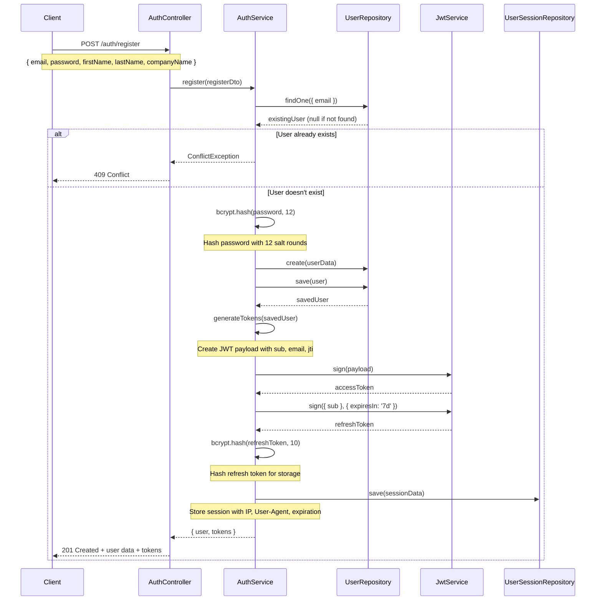
```mermaid
sequenceDiagram
    participant Client
    participant AuthController
    participant AuthService
    participant UserRepository
    participant JwtService
    participant UserSessionRepository

    Client->>AuthController: POST /auth/register
    Note over Client,AuthController: { email, password, firstName, lastName, companyName }
    
    AuthController->>AuthService: register(registerDto)
    
    AuthService->>UserRepository: findOne({ email })
    UserRepository-->>AuthService: existingUser (null if not found)
    
    alt User already exists
        AuthService-->>AuthController: ConflictException
        AuthController-->>Client: 409 Conflict
    else User doesn't exist
        AuthService->>AuthService: bcrypt.hash(password, 12)
        Note over AuthService: Hash password with 12 salt rounds
        
        AuthService->>UserRepository: create(userData)
        AuthService->>UserRepository: save(user)
        UserRepository-->>AuthService: savedUser
        
        AuthService->>AuthService: generateTokens(savedUser)
        Note over AuthService: Create JWT payload with sub, email, jti
        
        AuthService->>JwtService: sign(payload)
        JwtService-->>AuthService: accessToken
        
        AuthService->>JwtService: sign({ sub }, { expiresIn: '7d' })
        JwtService-->>AuthService: refreshToken
        
        AuthService->>AuthService: bcrypt.hash(refreshToken, 10)
        Note over AuthService: Hash refresh token for storage
        
        AuthService->>UserSessionRepository: save(sessionData)
        Note over AuthService: Store session with IP, User-Agent, expiration
        
        AuthService-->>AuthController: { user, tokens }
        AuthController-->>Client: 201 Created + user data + tokens
    end
```

### 2. User Login Flow

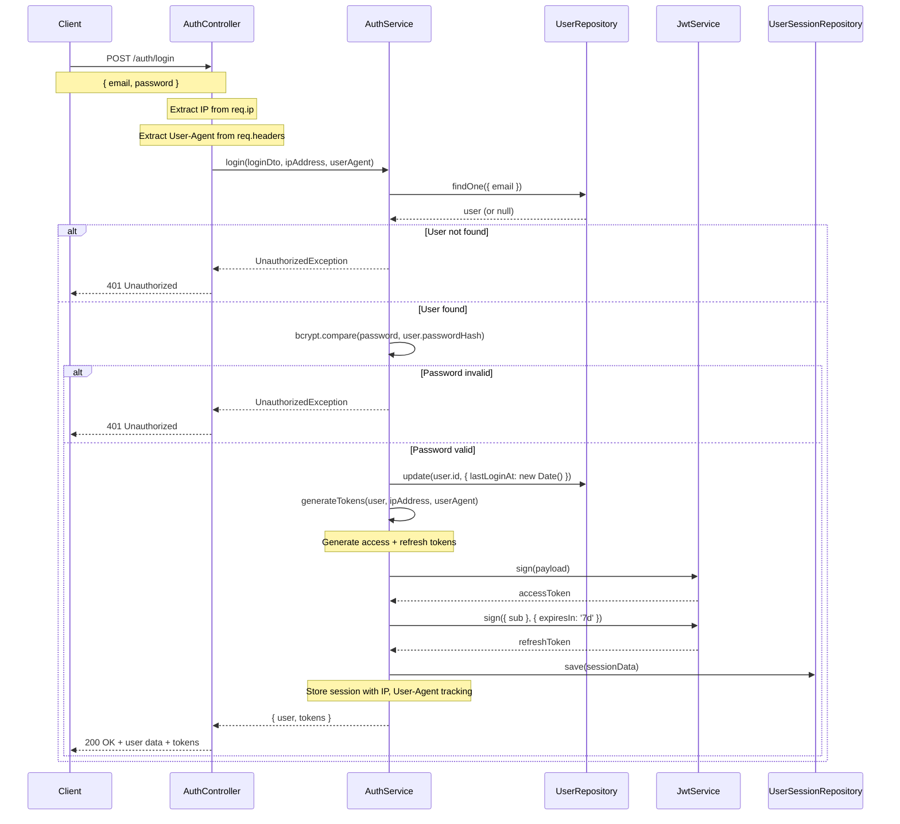
```mermaid
sequenceDiagram
    participant Client
    participant AuthController
    participant AuthService
    participant UserRepository
    participant JwtService
    participant UserSessionRepository

    Client->>AuthController: POST /auth/login
    Note over Client,AuthController: { email, password }
    Note over AuthController: Extract IP from req.ip
    Note over AuthController: Extract User-Agent from req.headers
    
    AuthController->>AuthService: login(loginDto, ipAddress, userAgent)
    
    AuthService->>UserRepository: findOne({ email })
    UserRepository-->>AuthService: user (or null)
    
    alt User not found
        AuthService-->>AuthController: UnauthorizedException
        AuthController-->>Client: 401 Unauthorized
    else User found
        AuthService->>AuthService: bcrypt.compare(password, user.passwordHash)
        
        alt Password invalid
            AuthService-->>AuthController: UnauthorizedException
            AuthController-->>Client: 401 Unauthorized
        else Password valid
            AuthService->>UserRepository: update(user.id, { lastLoginAt: new Date() })
            
            AuthService->>AuthService: generateTokens(user, ipAddress, userAgent)
            Note over AuthService: Generate access + refresh tokens
            
            AuthService->>JwtService: sign(payload)
            JwtService-->>AuthService: accessToken
            
            AuthService->>JwtService: sign({ sub }, { expiresIn: '7d' })
            JwtService-->>AuthService: refreshToken
            
            AuthService->>UserSessionRepository: save(sessionData)
            Note over AuthService: Store session with IP, User-Agent tracking
            
            AuthService-->>AuthController: { user, tokens }
            AuthController-->>Client: 200 OK + user data + tokens
        end
    end
```

### 3. Token Refresh Flow

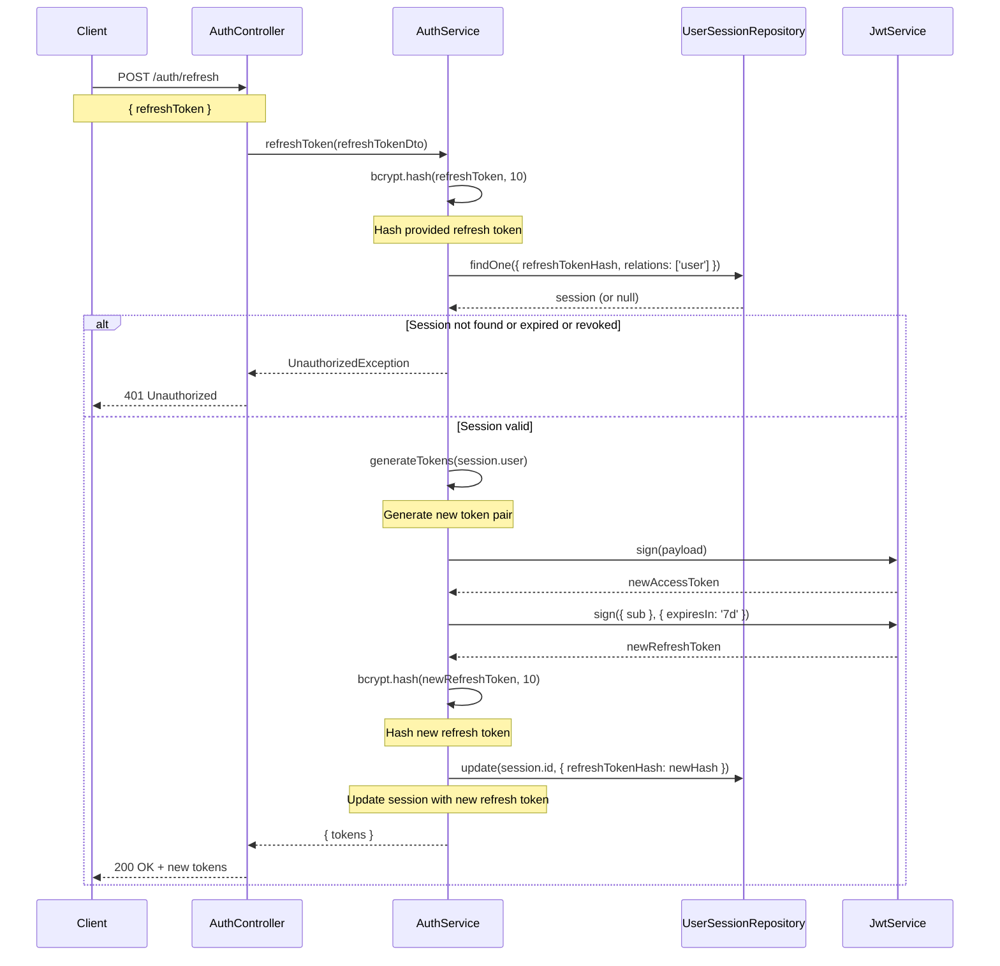
```mermaid
sequenceDiagram
    participant Client
    participant AuthController
    participant AuthService
    participant UserSessionRepository
    participant JwtService

    Client->>AuthController: POST /auth/refresh
    Note over Client,AuthController: { refreshToken }
    
    AuthController->>AuthService: refreshToken(refreshTokenDto)
    
    AuthService->>AuthService: bcrypt.hash(refreshToken, 10)
    Note over AuthService: Hash provided refresh token
    
    AuthService->>UserSessionRepository: findOne({ refreshTokenHash, relations: ['user'] })
    UserSessionRepository-->>AuthService: session (or null)
    
    alt Session not found or expired or revoked
        AuthService-->>AuthController: UnauthorizedException
        AuthController-->>Client: 401 Unauthorized
    else Session valid
        AuthService->>AuthService: generateTokens(session.user)
        Note over AuthService: Generate new token pair
        
        AuthService->>JwtService: sign(payload)
        JwtService-->>AuthService: newAccessToken
        
        AuthService->>JwtService: sign({ sub }, { expiresIn: '7d' })
        JwtService-->>AuthService: newRefreshToken
        
        AuthService->>AuthService: bcrypt.hash(newRefreshToken, 10)
        Note over AuthService: Hash new refresh token
        
        AuthService->>UserSessionRepository: update(session.id, { refreshTokenHash: newHash })
        Note over AuthService: Update session with new refresh token
        
        AuthService-->>AuthController: { tokens }
        AuthController-->>Client: 200 OK + new tokens
    end
```

---

## Chat Flow

### 1. Create Conversation Flow

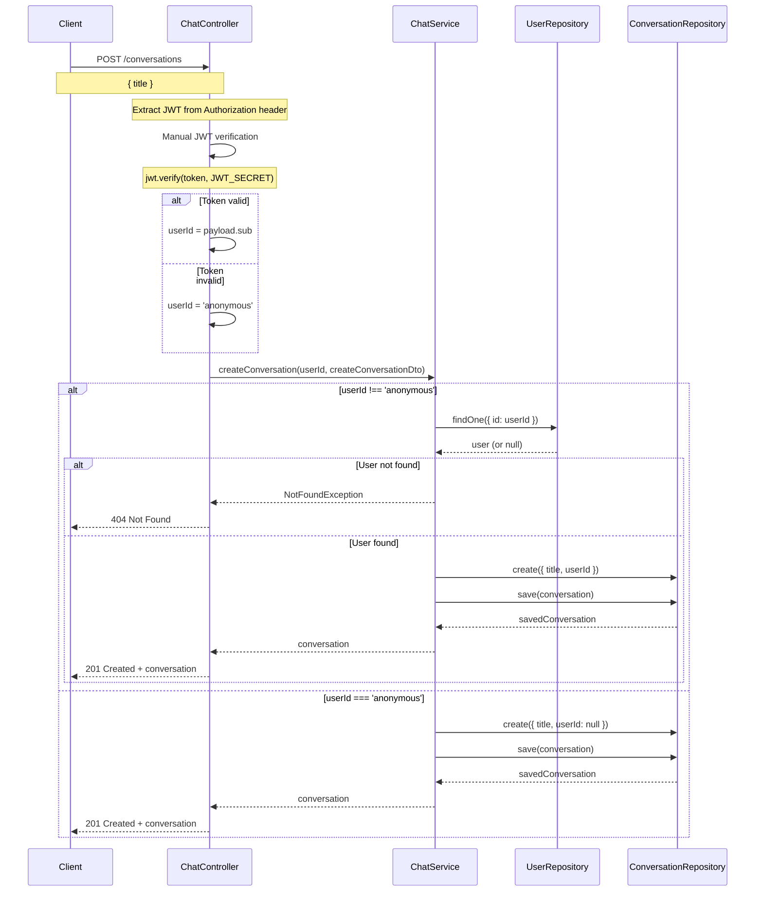
```mermaid
sequenceDiagram
    participant Client
    participant ChatController
    participant ChatService
    participant UserRepository
    participant ConversationRepository

    Client->>ChatController: POST /conversations
    Note over Client,ChatController: { title }
    Note over ChatController: Extract JWT from Authorization header
    
    ChatController->>ChatController: Manual JWT verification
    Note over ChatController: jwt.verify(token, JWT_SECRET)
    
    alt Token valid
        ChatController->>ChatController: userId = payload.sub
    else Token invalid
        ChatController->>ChatController: userId = 'anonymous'
    end
    
    ChatController->>ChatService: createConversation(userId, createConversationDto)
    
    alt userId !== 'anonymous'
        ChatService->>UserRepository: findOne({ id: userId })
        UserRepository-->>ChatService: user (or null)
        
        alt User not found
            ChatService-->>ChatController: NotFoundException
            ChatController-->>Client: 404 Not Found
        else User found
            ChatService->>ConversationRepository: create({ title, userId })
            ChatService->>ConversationRepository: save(conversation)
            ConversationRepository-->>ChatService: savedConversation
            ChatService-->>ChatController: conversation
            ChatController-->>Client: 201 Created + conversation
        end
    else userId === 'anonymous'
        ChatService->>ConversationRepository: create({ title, userId: null })
        ChatService->>ConversationRepository: save(conversation)
        ConversationRepository-->>ChatService: savedConversation
        ChatService-->>ChatController: conversation
        ChatController-->>Client: 201 Created + conversation
    end
```

### 2. Send Message Flow

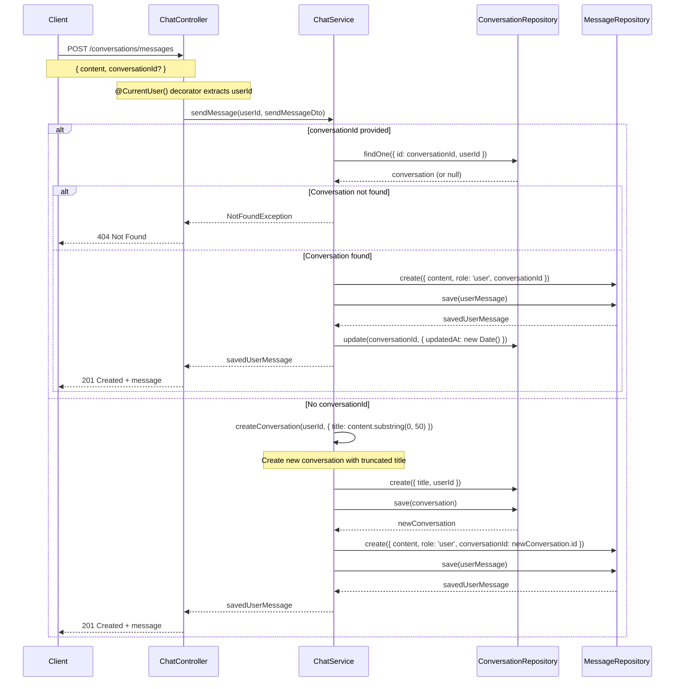
```mermaid
sequenceDiagram
    participant Client
    participant ChatController
    participant ChatService
    participant ConversationRepository
    participant MessageRepository

    Client->>ChatController: POST /conversations/messages
    Note over Client,ChatController: { content, conversationId? }
    Note over ChatController: @CurrentUser() decorator extracts userId
    
    ChatController->>ChatService: sendMessage(userId, sendMessageDto)
    
    alt conversationId provided
        ChatService->>ConversationRepository: findOne({ id: conversationId, userId })
        ConversationRepository-->>ChatService: conversation (or null)
        
        alt Conversation not found
            ChatService-->>ChatController: NotFoundException
            ChatController-->>Client: 404 Not Found
        else Conversation found
            ChatService->>MessageRepository: create({ content, role: 'user', conversationId })
            ChatService->>MessageRepository: save(userMessage)
            MessageRepository-->>ChatService: savedUserMessage
            
            ChatService->>ConversationRepository: update(conversationId, { updatedAt: new Date() })
            ChatService-->>ChatController: savedUserMessage
            ChatController-->>Client: 201 Created + message
        end
    else No conversationId
        ChatService->>ChatService: createConversation(userId, { title: content.substring(0, 50) })
        Note over ChatService: Create new conversation with truncated title
        
        ChatService->>ConversationRepository: create({ title, userId })
        ChatService->>ConversationRepository: save(conversation)
        ConversationRepository-->>ChatService: newConversation
        
        ChatService->>MessageRepository: create({ content, role: 'user', conversationId: newConversation.id })
        ChatService->>MessageRepository: save(userMessage)
        MessageRepository-->>ChatService: savedUserMessage
        
        ChatService-->>ChatController: savedUserMessage
        ChatController-->>Client: 201 Created + message
    end
```

### 3. AI Response Streaming Flow

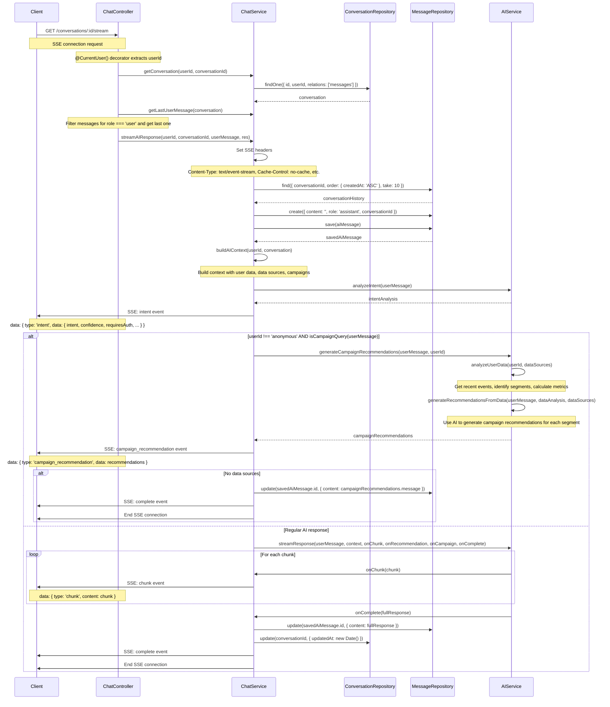
```mermaid
sequenceDiagram
    participant Client
    participant ChatController
    participant ChatService
    participant ConversationRepository
    participant MessageRepository
    participant AIService

    Client->>ChatController: GET /conversations/:id/stream
    Note over Client,ChatController: SSE connection request
    Note over ChatController: @CurrentUser() decorator extracts userId
    
    ChatController->>ChatService: getConversation(userId, conversationId)
    ChatService->>ConversationRepository: findOne({ id, userId, relations: ['messages'] })
    ConversationRepository-->>ChatService: conversation
    
    ChatController->>ChatService: getLastUserMessage(conversation)
    Note over ChatController: Filter messages for role === 'user' and get last one
    
    ChatController->>ChatService: streamAIResponse(userId, conversationId, userMessage, res)
    
    ChatService->>ChatService: Set SSE headers
    Note over ChatService: Content-Type: text/event-stream, Cache-Control: no-cache, etc.
    
    ChatService->>MessageRepository: find({ conversationId, order: { createdAt: 'ASC' }, take: 10 })
    MessageRepository-->>ChatService: conversationHistory
    
    ChatService->>MessageRepository: create({ content: '', role: 'assistant', conversationId })
    ChatService->>MessageRepository: save(aiMessage)
    MessageRepository-->>ChatService: savedAiMessage
    
    ChatService->>ChatService: buildAIContext(userId, conversation)
    Note over ChatService: Build context with user data, data sources, campaigns
    
    ChatService->>AIService: analyzeIntent(userMessage)
    AIService-->>ChatService: intentAnalysis
    ChatService->>Client: SSE: intent event
    Note over Client,ChatController: data: { type: 'intent', data: { intent, confidence, requiresAuth, ... } }
    
    alt userId !== 'anonymous' AND isCampaignQuery(userMessage)
        ChatService->>AIService: generateCampaignRecommendations(userMessage, userId)
        AIService->>AIService: analyzeUserData(userId, dataSources)
        Note over AIService: Get recent events, identify segments, calculate metrics
        
        AIService->>AIService: generateRecommendationsFromData(userMessage, dataAnalysis, dataSources)
        Note over AIService: Use AI to generate campaign recommendations for each segment
        
        AIService-->>ChatService: campaignRecommendations
        ChatService->>Client: SSE: campaign_recommendation event
        Note over Client,ChatController: data: { type: 'campaign_recommendation', data: recommendations }
        
        alt No data sources
            ChatService->>MessageRepository: update(savedAiMessage.id, { content: campaignRecommendations.message })
            ChatService->>Client: SSE: complete event
            ChatService->>Client: End SSE connection
        end
    else Regular AI response
        ChatService->>AIService: streamResponse(userMessage, context, onChunk, onRecommendation, onCampaign, onComplete)
        
        loop For each chunk
            AIService->>ChatService: onChunk(chunk)
            ChatService->>Client: SSE: chunk event
            Note over Client,ChatController: data: { type: 'chunk', content: chunk }
        end
        
        AIService->>ChatService: onComplete(fullResponse)
        ChatService->>MessageRepository: update(savedAiMessage.id, { content: fullResponse })
        ChatService->>ConversationRepository: update(conversationId, { updatedAt: new Date() })
        ChatService->>Client: SSE: complete event
        ChatService->>Client: End SSE connection
    end
```

---

## AI Service Flow

### 1. Intent Analysis Flow

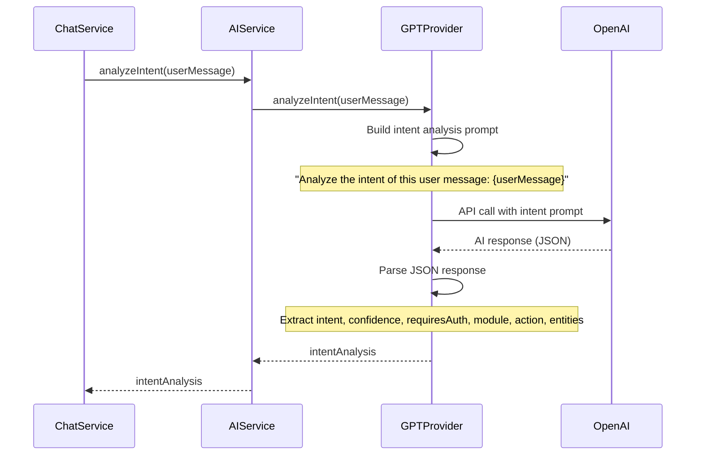
```mermaid
sequenceDiagram
    participant ChatService
    participant AIService
    participant GPTProvider
    participant OpenAI

    ChatService->>AIService: analyzeIntent(userMessage)
    AIService->>GPTProvider: analyzeIntent(userMessage)
    
    GPTProvider->>GPTProvider: Build intent analysis prompt
    Note over GPTProvider: "Analyze the intent of this user message: {userMessage}"
    
    GPTProvider->>OpenAI: API call with intent prompt
    OpenAI-->>GPTProvider: AI response (JSON)
    
    GPTProvider->>GPTProvider: Parse JSON response
    Note over GPTProvider: Extract intent, confidence, requiresAuth, module, action, entities
    
    GPTProvider-->>AIService: intentAnalysis
    AIService-->>ChatService: intentAnalysis
```

### 2. Campaign Recommendations Flow

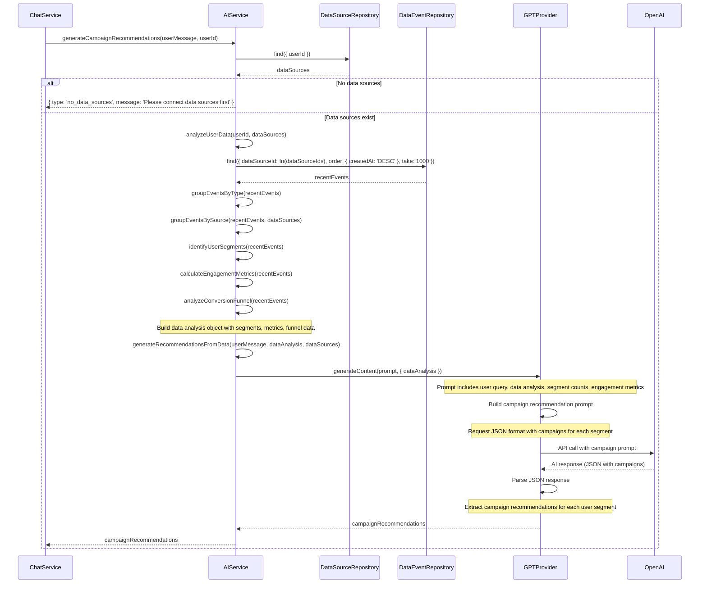
```mermaid
sequenceDiagram
    participant ChatService
    participant AIService
    participant DataSourceRepository
    participant DataEventRepository
    participant GPTProvider

    ChatService->>AIService: generateCampaignRecommendations(userMessage, userId)
    
    AIService->>DataSourceRepository: find({ userId })
    DataSourceRepository-->>AIService: dataSources
    
    alt No data sources
        AIService-->>ChatService: { type: 'no_data_sources', message: 'Please connect data sources first' }
    else Data sources exist
        AIService->>AIService: analyzeUserData(userId, dataSources)
        
        AIService->>DataEventRepository: find({ dataSourceId: In(dataSourceIds), order: { createdAt: 'DESC' }, take: 1000 })
        DataEventRepository-->>AIService: recentEvents
        
        AIService->>AIService: groupEventsByType(recentEvents)
        AIService->>AIService: groupEventsBySource(recentEvents, dataSources)
        AIService->>AIService: identifyUserSegments(recentEvents)
        AIService->>AIService: calculateEngagementMetrics(recentEvents)
        AIService->>AIService: analyzeConversionFunnel(recentEvents)
        
        Note over AIService: Build data analysis object with segments, metrics, funnel data
        
        AIService->>AIService: generateRecommendationsFromData(userMessage, dataAnalysis, dataSources)
        
        AIService->>GPTProvider: generateContent(prompt, { dataAnalysis })
        Note over GPTProvider: Prompt includes user query, data analysis, segment counts, engagement metrics
        
        GPTProvider->>GPTProvider: Build campaign recommendation prompt
        Note over GPTProvider: Request JSON format with campaigns for each segment
        
        GPTProvider->>OpenAI: API call with campaign prompt
        OpenAI-->>GPTProvider: AI response (JSON with campaigns)
        
        GPTProvider->>GPTProvider: Parse JSON response
        Note over GPTProvider: Extract campaign recommendations for each user segment
        
        GPTProvider-->>AIService: campaignRecommendations
        AIService-->>ChatService: campaignRecommendations
    end
```

### 3. User Segmentation Flow

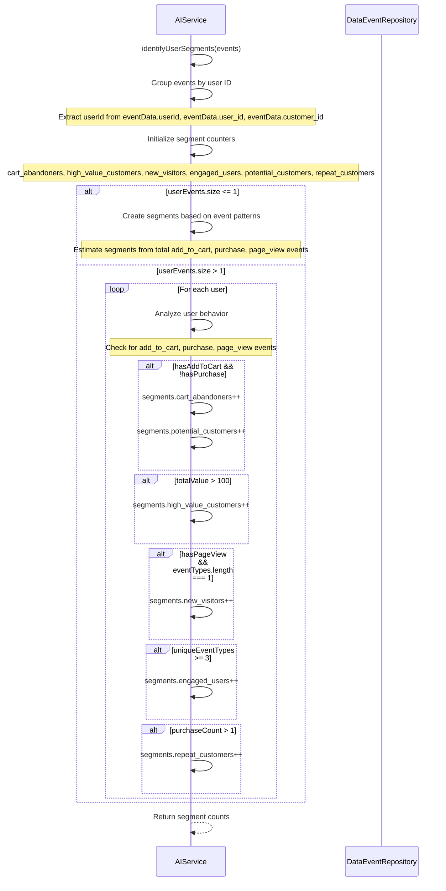
```mermaid
sequenceDiagram
    participant AIService
    participant DataEventRepository

    AIService->>AIService: identifyUserSegments(events)
    
    AIService->>AIService: Group events by user ID
    Note over AIService: Extract userId from eventData.userId, eventData.user_id, eventData.customer_id
    
    AIService->>AIService: Initialize segment counters
    Note over AIService: cart_abandoners, high_value_customers, new_visitors, engaged_users, potential_customers, repeat_customers
    
    alt userEvents.size <= 1
        AIService->>AIService: Create segments based on event patterns
        Note over AIService: Estimate segments from total add_to_cart, purchase, page_view events
    else userEvents.size > 1
        loop For each user
            AIService->>AIService: Analyze user behavior
            Note over AIService: Check for add_to_cart, purchase, page_view events
            
            alt hasAddToCart && !hasPurchase
                AIService->>AIService: segments.cart_abandoners++
                AIService->>AIService: segments.potential_customers++
            end
            
            alt totalValue > 100
                AIService->>AIService: segments.high_value_customers++
            end
            
            alt hasPageView && eventTypes.length === 1
                AIService->>AIService: segments.new_visitors++
            end
            
            alt uniqueEventTypes >= 3
                AIService->>AIService: segments.engaged_users++
            end
            
            alt purchaseCount > 1
                AIService->>AIService: segments.repeat_customers++
            end
        end
    end
    
    AIService-->>AIService: Return segment counts
```

---

## Data Integration Flow

### 1. Create Data Source Flow

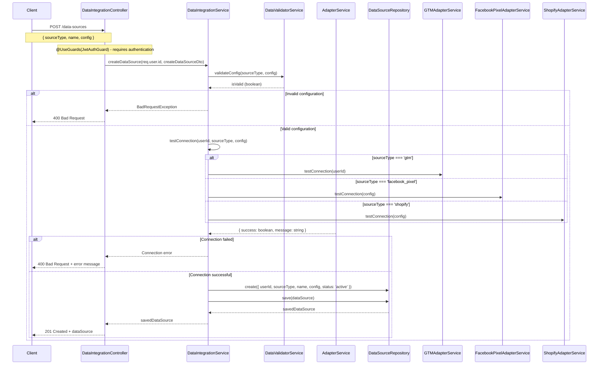
```mermaid
sequenceDiagram
    participant Client
    participant DataIntegrationController
    participant DataIntegrationService
    participant DataValidatorService
    participant AdapterService
    participant DataSourceRepository

    Client->>DataIntegrationController: POST /data-sources
    Note over Client,DataIntegrationController: { sourceType, name, config }
    Note over DataIntegrationController: @UseGuards(JwtAuthGuard) - requires authentication
    
    DataIntegrationController->>DataIntegrationService: createDataSource(req.user.id, createDataSourceDto)
    
    DataIntegrationService->>DataValidatorService: validateConfig(sourceType, config)
    DataValidatorService-->>DataIntegrationService: isValid (boolean)
    
    alt Invalid configuration
        DataIntegrationService-->>DataIntegrationController: BadRequestException
        DataIntegrationController-->>Client: 400 Bad Request
    else Valid configuration
        DataIntegrationService->>DataIntegrationService: testConnection(userId, sourceType, config)
        
        alt sourceType === 'gtm'
            DataIntegrationService->>GTMAdapterService: testConnection(userId)
        else sourceType === 'facebook_pixel'
            DataIntegrationService->>FacebookPixelAdapterService: testConnection(config)
        else sourceType === 'shopify'
            DataIntegrationService->>ShopifyAdapterService: testConnection(config)
        end
        
        AdapterService-->>DataIntegrationService: { success: boolean, message: string }
        
        alt Connection failed
            DataIntegrationService-->>DataIntegrationController: Connection error
            DataIntegrationController-->>Client: 400 Bad Request + error message
        else Connection successful
            DataIntegrationService->>DataSourceRepository: create({ userId, sourceType, name, config, status: 'active' })
            DataIntegrationService->>DataSourceRepository: save(dataSource)
            DataSourceRepository-->>DataIntegrationService: savedDataSource
            
            DataIntegrationService-->>DataIntegrationController: savedDataSource
            DataIntegrationController-->>Client: 201 Created + dataSource
        end
    end
```

### 2. Sync Data Source Flow

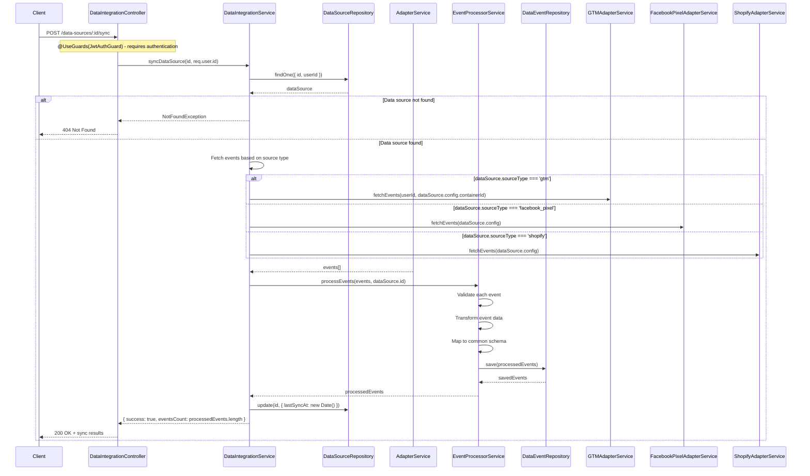
```mermaid
sequenceDiagram
    participant Client
    participant DataIntegrationController
    participant DataIntegrationService
    participant DataSourceRepository
    participant AdapterService
    participant EventProcessorService
    participant DataEventRepository

    Client->>DataIntegrationController: POST /data-sources/:id/sync
    Note over DataIntegrationController: @UseGuards(JwtAuthGuard) - requires authentication
    
    DataIntegrationController->>DataIntegrationService: syncDataSource(id, req.user.id)
    
    DataIntegrationService->>DataSourceRepository: findOne({ id, userId })
    DataSourceRepository-->>DataIntegrationService: dataSource
    
    alt Data source not found
        DataIntegrationService-->>DataIntegrationController: NotFoundException
        DataIntegrationController-->>Client: 404 Not Found
    else Data source found
        DataIntegrationService->>DataIntegrationService: Fetch events based on source type
        
        alt dataSource.sourceType === 'gtm'
            DataIntegrationService->>GTMAdapterService: fetchEvents(userId, dataSource.config.containerId)
        else dataSource.sourceType === 'facebook_pixel'
            DataIntegrationService->>FacebookPixelAdapterService: fetchEvents(dataSource.config)
        else dataSource.sourceType === 'shopify'
            DataIntegrationService->>ShopifyAdapterService: fetchEvents(dataSource.config)
        end
        
        AdapterService-->>DataIntegrationService: events[]
        
        DataIntegrationService->>EventProcessorService: processEvents(events, dataSource.id)
        
        EventProcessorService->>EventProcessorService: Validate each event
        EventProcessorService->>EventProcessorService: Transform event data
        EventProcessorService->>EventProcessorService: Map to common schema
        
        EventProcessorService->>DataEventRepository: save(processedEvents)
        DataEventRepository-->>EventProcessorService: savedEvents
        
        EventProcessorService-->>DataIntegrationService: processedEvents
        
        DataIntegrationService->>DataSourceRepository: update(id, { lastSyncAt: new Date() })
        
        DataIntegrationService-->>DataIntegrationController: { success: true, eventsCount: processedEvents.length }
        DataIntegrationController-->>Client: 200 OK + sync results
    end
```

### 3. Generate Dummy Data Flow

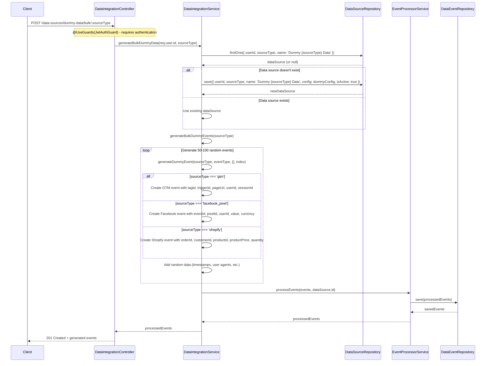
```mermaid
sequenceDiagram
    participant Client
    participant DataIntegrationController
    participant DataIntegrationService
    participant DataSourceRepository
    participant EventProcessorService
    participant DataEventRepository

    Client->>DataIntegrationController: POST /data-sources/dummy-data/bulk/:sourceType
    Note over DataIntegrationController: @UseGuards(JwtAuthGuard) - requires authentication
    
    DataIntegrationController->>DataIntegrationService: generateBulkDummyData(req.user.id, sourceType)
    
    DataIntegrationService->>DataSourceRepository: findOne({ userId, sourceType, name: 'Dummy {sourceType} Data' })
    DataSourceRepository-->>DataIntegrationService: dataSource (or null)
    
    alt Data source doesn't exist
        DataIntegrationService->>DataSourceRepository: save({ userId, sourceType, name: 'Dummy {sourceType} Data', config: dummyConfig, isActive: true })
        DataSourceRepository-->>DataIntegrationService: newDataSource
    else Data source exists
        DataIntegrationService->>DataIntegrationService: Use existing dataSource
    end
    
    DataIntegrationService->>DataIntegrationService: generateBulkDummyEvents(sourceType)
    
    loop Generate 50-100 random events
        DataIntegrationService->>DataIntegrationService: generateDummyEvent(sourceType, eventType, {}, index)
        
        alt sourceType === 'gtm'
            DataIntegrationService->>DataIntegrationService: Create GTM event with tagId, triggerId, pageUrl, userId, sessionId
        else sourceType === 'facebook_pixel'
            DataIntegrationService->>DataIntegrationService: Create Facebook event with eventId, pixelId, userId, value, currency
        else sourceType === 'shopify'
            DataIntegrationService->>DataIntegrationService: Create Shopify event with orderId, customerId, productId, productPrice, quantity
        end
        
        DataIntegrationService->>DataIntegrationService: Add random data (timestamps, user agents, etc.)
    end
    
    DataIntegrationService->>EventProcessorService: processEvents(events, dataSource.id)
    
    EventProcessorService->>DataEventRepository: save(processedEvents)
    DataEventRepository-->>EventProcessorService: savedEvents
    
    EventProcessorService-->>DataIntegrationService: processedEvents
    
    DataIntegrationService-->>DataIntegrationController: processedEvents
    DataIntegrationController-->>Client: 201 Created + generated events
```

---

## User Profile Flow

### 1. Get User Profile Flow

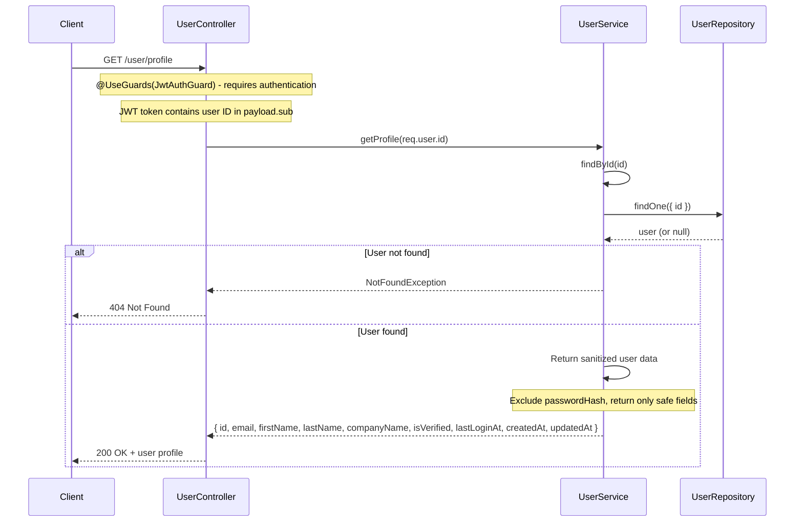
```mermaid
sequenceDiagram
    participant Client
    participant UserController
    participant UserService
    participant UserRepository

    Client->>UserController: GET /user/profile
    Note over UserController: @UseGuards(JwtAuthGuard) - requires authentication
    Note over UserController: JWT token contains user ID in payload.sub
    
    UserController->>UserService: getProfile(req.user.id)
    
    UserService->>UserService: findById(id)
    UserService->>UserRepository: findOne({ id })
    UserRepository-->>UserService: user (or null)
    
    alt User not found
        UserService-->>UserController: NotFoundException
        UserController-->>Client: 404 Not Found
    else User found
        UserService->>UserService: Return sanitized user data
        Note over UserService: Exclude passwordHash, return only safe fields
        
        UserService-->>UserController: { id, email, firstName, lastName, companyName, isVerified, lastLoginAt, createdAt, updatedAt }
        UserController-->>Client: 200 OK + user profile
    end
```

---

## Cross-Module Interactions

### 1. Chat with AI Integration Flow

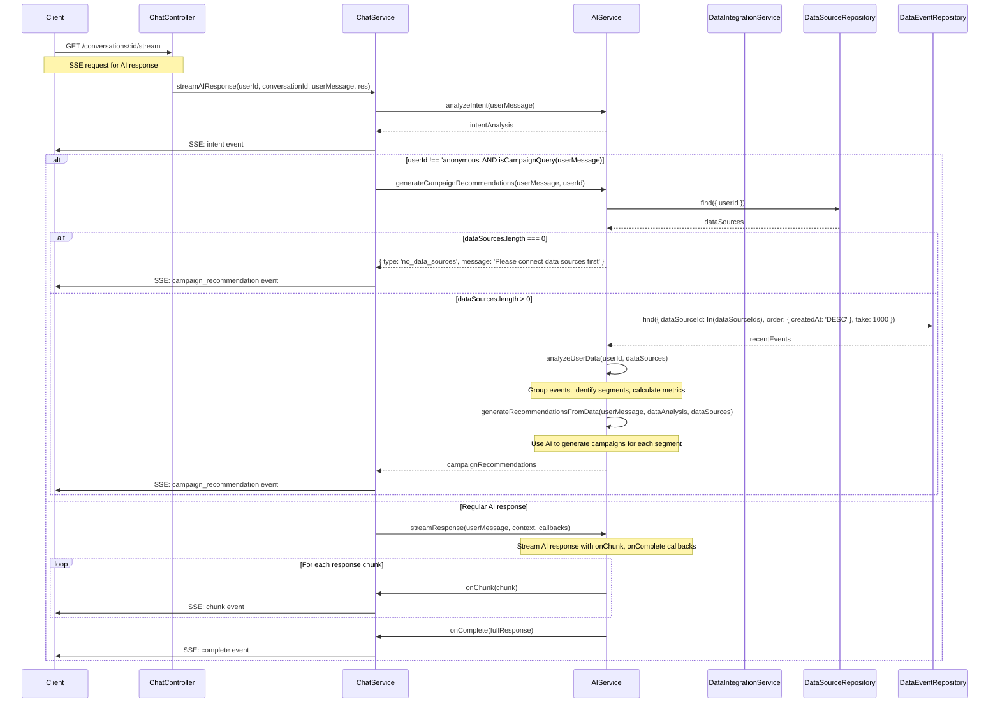
```mermaid
sequenceDiagram
    participant Client
    participant ChatController
    participant ChatService
    participant AIService
    participant DataIntegrationService
    participant DataSourceRepository
    participant DataEventRepository

    Client->>ChatController: GET /conversations/:id/stream
    Note over Client,ChatController: SSE request for AI response
    
    ChatController->>ChatService: streamAIResponse(userId, conversationId, userMessage, res)
    
    ChatService->>AIService: analyzeIntent(userMessage)
    AIService-->>ChatService: intentAnalysis
    ChatService->>Client: SSE: intent event
    
    alt userId !== 'anonymous' AND isCampaignQuery(userMessage)
        ChatService->>AIService: generateCampaignRecommendations(userMessage, userId)
        
        AIService->>DataSourceRepository: find({ userId })
        DataSourceRepository-->>AIService: dataSources
        
        alt dataSources.length === 0
            AIService-->>ChatService: { type: 'no_data_sources', message: 'Please connect data sources first' }
            ChatService->>Client: SSE: campaign_recommendation event
        else dataSources.length > 0
            AIService->>DataEventRepository: find({ dataSourceId: In(dataSourceIds), order: { createdAt: 'DESC' }, take: 1000 })
            DataEventRepository-->>AIService: recentEvents
            
            AIService->>AIService: analyzeUserData(userId, dataSources)
            Note over AIService: Group events, identify segments, calculate metrics
            
            AIService->>AIService: generateRecommendationsFromData(userMessage, dataAnalysis, dataSources)
            Note over AIService: Use AI to generate campaigns for each segment
            
            AIService-->>ChatService: campaignRecommendations
            ChatService->>Client: SSE: campaign_recommendation event
        end
    else Regular AI response
        ChatService->>AIService: streamResponse(userMessage, context, callbacks)
        Note over AIService: Stream AI response with onChunk, onComplete callbacks
        
        loop For each response chunk
            AIService->>ChatService: onChunk(chunk)
            ChatService->>Client: SSE: chunk event
        end
        
        AIService->>ChatService: onComplete(fullResponse)
        ChatService->>Client: SSE: complete event
    end
```

### 2. Authentication Guard Flow

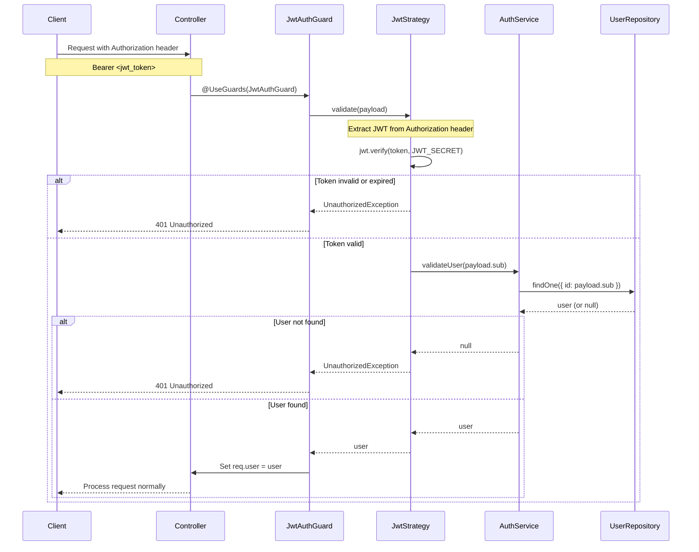
```mermaid
sequenceDiagram
    participant Client
    participant Controller
    participant JwtAuthGuard
    participant JwtStrategy
    participant AuthService
    participant UserRepository

    Client->>Controller: Request with Authorization header
    Note over Client,Controller: Bearer <jwt_token>
    
    Controller->>JwtAuthGuard: @UseGuards(JwtAuthGuard)
    
    JwtAuthGuard->>JwtStrategy: validate(payload)
    Note over JwtStrategy: Extract JWT from Authorization header
    
    JwtStrategy->>JwtStrategy: jwt.verify(token, JWT_SECRET)
    
    alt Token invalid or expired
        JwtStrategy-->>JwtAuthGuard: UnauthorizedException
        JwtAuthGuard-->>Client: 401 Unauthorized
    else Token valid
        JwtStrategy->>AuthService: validateUser(payload.sub)
        AuthService->>UserRepository: findOne({ id: payload.sub })
        UserRepository-->>AuthService: user (or null)
        
        alt User not found
            AuthService-->>JwtStrategy: null
            JwtStrategy-->>JwtAuthGuard: UnauthorizedException
            JwtAuthGuard-->>Client: 401 Unauthorized
        else User found
            AuthService-->>JwtStrategy: user
            JwtStrategy-->>JwtAuthGuard: user
            JwtAuthGuard->>Controller: Set req.user = user
            Controller-->>Client: Process request normally
        end
    end
```

### 3. Data Flow for Campaign Recommendations

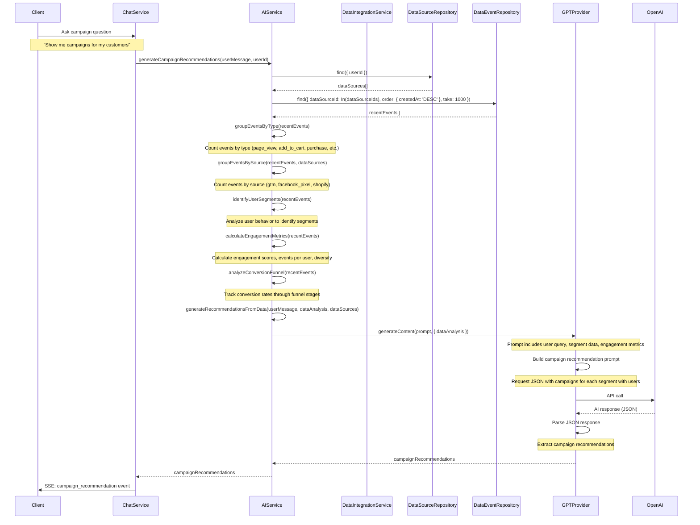
```mermaid
sequenceDiagram
    participant Client
    participant ChatService
    participant AIService
    participant DataIntegrationService
    participant DataSourceRepository
    participant DataEventRepository
    participant GPTProvider

    Client->>ChatService: Ask campaign question
    Note over Client,ChatService: "Show me campaigns for my customers"
    
    ChatService->>AIService: generateCampaignRecommendations(userMessage, userId)
    
    AIService->>DataSourceRepository: find({ userId })
    DataSourceRepository-->>AIService: dataSources[]
    
    AIService->>DataEventRepository: find({ dataSourceId: In(dataSourceIds), order: { createdAt: 'DESC' }, take: 1000 })
    DataEventRepository-->>AIService: recentEvents[]
    
    AIService->>AIService: groupEventsByType(recentEvents)
    Note over AIService: Count events by type (page_view, add_to_cart, purchase, etc.)
    
    AIService->>AIService: groupEventsBySource(recentEvents, dataSources)
    Note over AIService: Count events by source (gtm, facebook_pixel, shopify)
    
    AIService->>AIService: identifyUserSegments(recentEvents)
    Note over AIService: Analyze user behavior to identify segments
    
    AIService->>AIService: calculateEngagementMetrics(recentEvents)
    Note over AIService: Calculate engagement scores, events per user, diversity
    
    AIService->>AIService: analyzeConversionFunnel(recentEvents)
    Note over AIService: Track conversion rates through funnel stages
    
    AIService->>AIService: generateRecommendationsFromData(userMessage, dataAnalysis, dataSources)
    
    AIService->>GPTProvider: generateContent(prompt, { dataAnalysis })
    Note over GPTProvider: Prompt includes user query, segment data, engagement metrics
    
    GPTProvider->>GPTProvider: Build campaign recommendation prompt
    Note over GPTProvider: Request JSON with campaigns for each segment with users
    
    GPTProvider->>OpenAI: API call
    OpenAI-->>GPTProvider: AI response (JSON)
    
    GPTProvider->>GPTProvider: Parse JSON response
    Note over GPTProvider: Extract campaign recommendations
    
    GPTProvider-->>AIService: campaignRecommendations
    AIService-->>ChatService: campaignRecommendations
    ChatService->>Client: SSE: campaign_recommendation event
```

---

## Error Handling Flows

### 1. Authentication Error Flow

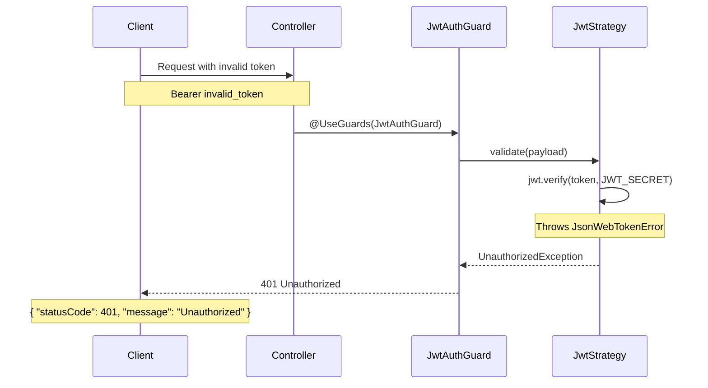
```mermaid
sequenceDiagram
    participant Client
    participant Controller
    participant JwtAuthGuard
    participant JwtStrategy

    Client->>Controller: Request with invalid token
    Note over Client,Controller: Bearer invalid_token
    
    Controller->>JwtAuthGuard: @UseGuards(JwtAuthGuard)
    JwtAuthGuard->>JwtStrategy: validate(payload)
    
    JwtStrategy->>JwtStrategy: jwt.verify(token, JWT_SECRET)
    Note over JwtStrategy: Throws JsonWebTokenError
    
    JwtStrategy-->>JwtAuthGuard: UnauthorizedException
    JwtAuthGuard-->>Client: 401 Unauthorized
    Note over Client: { "statusCode": 401, "message": "Unauthorized" }
```

### 2. Database Error Flow

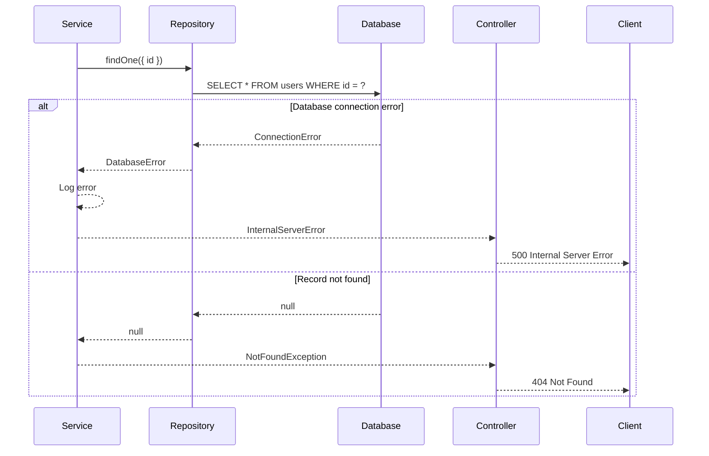
```mermaid
sequenceDiagram
    participant Service
    participant Repository
    participant Database

    Service->>Repository: findOne({ id })
    Repository->>Database: SELECT * FROM users WHERE id = ?
    
    alt Database connection error
        Database-->>Repository: ConnectionError
        Repository-->>Service: DatabaseError
        Service-->>Service: Log error
        Service-->>Controller: InternalServerError
        Controller-->>Client: 500 Internal Server Error
    else Record not found
        Database-->>Repository: null
        Repository-->>Service: null
        Service-->>Controller: NotFoundException
        Controller-->>Client: 404 Not Found
    end
```

### 3. AI Service Error Flow

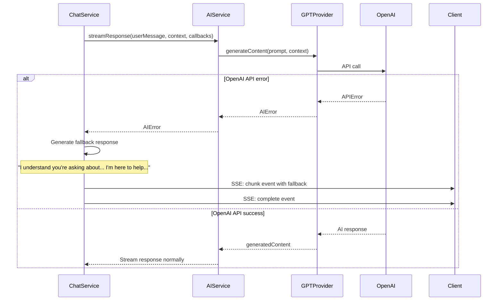
```mermaid
sequenceDiagram
    participant ChatService
    participant AIService
    participant GPTProvider
    participant OpenAI

    ChatService->>AIService: streamResponse(userMessage, context, callbacks)
    AIService->>GPTProvider: generateContent(prompt, context)
    GPTProvider->>OpenAI: API call
    
    alt OpenAI API error
        OpenAI-->>GPTProvider: APIError
        GPTProvider-->>AIService: AIError
        AIService-->>ChatService: AIError
        
        ChatService->>ChatService: Generate fallback response
        Note over ChatService: "I understand you're asking about... I'm here to help..."
        
        ChatService->>Client: SSE: chunk event with fallback
        ChatService->>Client: SSE: complete event
    else OpenAI API success
        OpenAI-->>GPTProvider: AI response
        GPTProvider-->>AIService: generatedContent
        AIService-->>ChatService: Stream response normally
    end
```

---

This documentation provides a comprehensive view of how data flows through the backend modules, showing the complete request/response cycles, service interactions, and error handling patterns.
