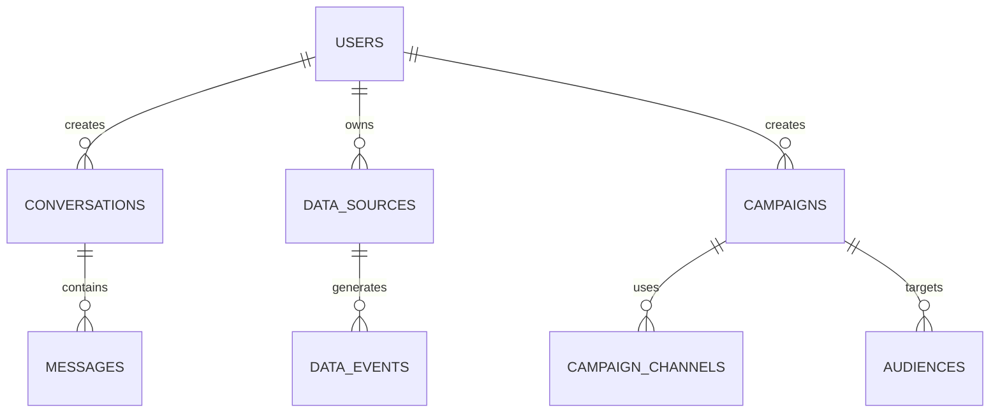

# Database Design - TypeORM Entities

## Core Entity Relationships



## TypeORM Entity Definitions

### User Entity
```typescript
import { Entity, PrimaryGeneratedColumn, Column, CreateDateColumn, UpdateDateColumn, OneToMany } from 'typeorm';
import { Conversation } from './conversation.entity';
import { DataSource } from './data-source.entity';
import { Campaign } from './campaign.entity';
import { UserSession } from './user-session.entity';

@Entity('users')
export class User {
  @PrimaryGeneratedColumn('uuid')
  id: string;

  @Column({ unique: true })
  email: string;

  @Column()
  password: string;

  @Column({ nullable: true })
  firstName: string;

  @Column({ nullable: true })
  lastName: string;

  @Column({ nullable: true })
  companyName: string;

  @CreateDateColumn()
  createdAt: Date;

  @UpdateDateColumn()
  updatedAt: Date;

  @OneToMany(() => Conversation, conversation => conversation.user)
  conversations: Conversation[];

  @OneToMany(() => DataSource, dataSource => dataSource.user)
  dataSources: DataSource[];

  @OneToMany(() => Campaign, campaign => campaign.user)
  campaigns: Campaign[];

  @OneToMany(() => UserSession, session => session.user)
  sessions: UserSession[];
}
```

### UserSession Entity
```typescript
import { Entity, PrimaryGeneratedColumn, Column, CreateDateColumn, UpdateDateColumn, ManyToOne, JoinColumn } from 'typeorm';
import { User } from './user.entity';

@Entity('user_sessions')
export class UserSession {
  @PrimaryGeneratedColumn('uuid')
  id: string;

  @Column()
  userId: string;

  @Column()
  refreshToken: string;

  @Column()
  expiresAt: Date;

  @CreateDateColumn()
  createdAt: Date;

  @UpdateDateColumn()
  updatedAt: Date;

  @ManyToOne(() => User, user => user.sessions, { onDelete: 'CASCADE' })
  @JoinColumn({ name: 'userId' })
  user: User;
}
```

### TokenBlacklist Entity
```typescript
import { Entity, PrimaryGeneratedColumn, Column, CreateDateColumn, ManyToOne, JoinColumn } from 'typeorm';
import { User } from './user.entity';

@Entity('token_blacklist')
export class TokenBlacklist {
  @PrimaryGeneratedColumn('uuid')
  id: string;

  @Column({ unique: true })
  token: string;

  @Column()
  expiresAt: Date;

  @CreateDateColumn()
  createdAt: Date;
}

### DataSource Entity
```typescript
import { Entity, PrimaryGeneratedColumn, Column, CreateDateColumn, UpdateDateColumn, ManyToOne, JoinColumn, OneToMany } from 'typeorm';
import { User } from './user.entity';
import { DataEvent } from './data-event.entity';

@Entity('data_sources')
export class DataSource {
  @PrimaryGeneratedColumn('uuid')
  id: string;

  @Column()
  userId: string;

  @Column()
  sourceType: 'gtm' | 'facebook_pixel' | 'shopify';

  @Column()
  name: string;

  @Column('jsonb')
  config: Record<string, any>;

  @Column({ default: true })
  isActive: boolean;

  @CreateDateColumn()
  createdAt: Date;

  @UpdateDateColumn()
  updatedAt: Date;

  @ManyToOne(() => User, user => user.dataSources, { onDelete: 'CASCADE' })
  @JoinColumn({ name: 'userId' })
  user: User;

  @OneToMany(() => DataEvent, event => event.dataSource)
  events: DataEvent[];
}
```

### Conversation Entity
```typescript
import { Entity, PrimaryGeneratedColumn, Column, CreateDateColumn, UpdateDateColumn, ManyToOne, JoinColumn, OneToMany } from 'typeorm';
import { User } from './user.entity';
import { Message } from './message.entity';

@Entity('conversations')
export class Conversation {
  @PrimaryGeneratedColumn('uuid')
  id: string;

  @Column()
  userId: string;

  @Column({ nullable: true })
  title: string;

  @Column({ default: 'active' })
  status: 'active' | 'archived' | 'deleted';

  @CreateDateColumn()
  createdAt: Date;

  @UpdateDateColumn()
  updatedAt: Date;

  @ManyToOne(() => User, user => user.conversations, { onDelete: 'CASCADE' })
  @JoinColumn({ name: 'userId' })
  user: User;

  @OneToMany(() => Message, message => message.conversation)
  messages: Message[];
}
```

### Message Entity
```typescript
import { Entity, PrimaryGeneratedColumn, Column, CreateDateColumn, ManyToOne, JoinColumn } from 'typeorm';
import { Conversation } from './conversation.entity';

@Entity('messages')
export class Message {
  @PrimaryGeneratedColumn('uuid')
  id: string;

  @Column()
  conversationId: string;

  @Column()
  role: 'user' | 'assistant';

  @Column('text')
  content: string;

  @Column('jsonb', { nullable: true })
  metadata: Record<string, any>;

  @CreateDateColumn()
  createdAt: Date;

  @ManyToOne(() => Conversation, conversation => conversation.messages, { onDelete: 'CASCADE' })
  @JoinColumn({ name: 'conversationId' })
  conversation: Conversation;
}

### Campaign Entity
```typescript
import { Entity, PrimaryGeneratedColumn, Column, CreateDateColumn, UpdateDateColumn, ManyToOne, JoinColumn, OneToMany } from 'typeorm';
import { User } from './user.entity';
import { Conversation } from './conversation.entity';
import { CampaignChannel } from './campaign-channel.entity';

@Entity('campaigns')
export class Campaign {
  @PrimaryGeneratedColumn('uuid')
  id: string;

  @Column()
  userId: string;

  @Column({ nullable: true })
  conversationId: string;

  @Column()
  name: string;

  @Column('text', { nullable: true })
  description: string;

  @Column({ default: 'draft' })
  status: 'draft' | 'scheduled' | 'running' | 'paused' | 'completed';

  @Column({ nullable: true })
  scheduledAt: Date;

  @Column({ nullable: true })
  startedAt: Date;

  @Column({ nullable: true })
  endedAt: Date;

  @Column('jsonb')
  config: Record<string, any>;

  @CreateDateColumn()
  createdAt: Date;

  @UpdateDateColumn()
  updatedAt: Date;

  @ManyToOne(() => User, user => user.campaigns, { onDelete: 'CASCADE' })
  @JoinColumn({ name: 'userId' })
  user: User;

  @ManyToOne(() => Conversation, { nullable: true })
  @JoinColumn({ name: 'conversationId' })
  conversation: Conversation;

  @OneToMany(() => CampaignChannel, channel => channel.campaign)
  channels: CampaignChannel[];
}
```

### CampaignChannel Entity
```typescript
import { Entity, PrimaryGeneratedColumn, Column, CreateDateColumn, UpdateDateColumn, ManyToOne, JoinColumn } from 'typeorm';
import { Campaign } from './campaign.entity';

@Entity('campaign_channels')
export class CampaignChannel {
  @PrimaryGeneratedColumn('uuid')
  id: string;

  @Column()
  campaignId: string;

  @Column()
  channelType: 'email' | 'sms' | 'push' | 'whatsapp';

  @Column('jsonb')
  config: Record<string, any>;

  @Column({ default: 'pending' })
  status: 'pending' | 'sending' | 'sent' | 'failed';

  @Column({ default: 0 })
  sentCount: number;

  @Column({ default: 0 })
  deliveredCount: number;

  @Column({ default: 0 })
  openedCount: number;

  @Column({ default: 0 })
  clickedCount: number;

  @CreateDateColumn()
  createdAt: Date;

  @UpdateDateColumn()
  updatedAt: Date;

  @ManyToOne(() => Campaign, campaign => campaign.channels, { onDelete: 'CASCADE' })
  @JoinColumn({ name: 'campaignId' })
  campaign: Campaign;
}
```

### DataEvent Entity
```typescript
import { Entity, PrimaryGeneratedColumn, Column, CreateDateColumn, ManyToOne, JoinColumn } from 'typeorm';
import { DataSource } from './data-source.entity';

@Entity('data_events')
export class DataEvent {
  @PrimaryGeneratedColumn('uuid')
  id: string;

  @Column()
  dataSourceId: string;

  @Column()
  eventType: string;

  @Column('jsonb')
  eventData: Record<string, any>;

  @Column({ nullable: true })
  processedAt: Date;

  @CreateDateColumn()
  createdAt: Date;

  @ManyToOne(() => DataSource, dataSource => dataSource.events, { onDelete: 'CASCADE' })
  @JoinColumn({ name: 'dataSourceId' })
  dataSource: DataSource;
}
```

### RecommendationHistory Entity
```typescript
import { Entity, PrimaryGeneratedColumn, Column, CreateDateColumn, ManyToOne, JoinColumn } from 'typeorm';
import { User } from './user.entity';
import { Conversation } from './conversation.entity';

@Entity('recommendation_history')
export class RecommendationHistory {
  @PrimaryGeneratedColumn('uuid')
  id: string;

  @Column()
  userId: string;

  @Column({ nullable: true })
  conversationId: string;

  @Column('text')
  originalQuery: string;

  @Column('jsonb')
  aiRecommendation: Record<string, any>;

  @Column({ nullable: true })
  userAccepted: boolean;

  @Column('jsonb', { nullable: true })
  campaignResults: {
    openRate?: number;
    clickRate?: number;
    conversionRate?: number;
    revenue?: number;
  };

  @Column({ nullable: true })
  userFeedback: 'positive' | 'negative' | 'neutral';

  @Column({ nullable: true })
  aiProvider: string; // 'gpt', 'custom', 'hybrid'

  @Column('jsonb', { nullable: true })
  context: Record<string, any>;

  @CreateDateColumn()
  createdAt: Date;

  @ManyToOne(() => User, { onDelete: 'CASCADE' })
  @JoinColumn({ name: 'userId' })
  user: User;

  @ManyToOne(() => Conversation, { nullable: true })
  @JoinColumn({ name: 'conversationId' })
  conversation: Conversation;
}
```

### AIProviderConfig Entity
```typescript
import { Entity, PrimaryGeneratedColumn, Column, CreateDateColumn, UpdateDateColumn } from 'typeorm';

@Entity('ai_provider_config')
export class AIProviderConfig {
  @PrimaryGeneratedColumn('uuid')
  id: string;

  @Column()
  providerName: string; // 'gpt', 'custom', 'hybrid'

  @Column()
  isActive: boolean;

  @Column('jsonb')
  config: {
    apiKey?: string;
    model?: string;
    temperature?: number;
    maxTokens?: number;
    customSettings?: Record<string, any>;
  };

  @Column('jsonb', { nullable: true })
  performanceMetrics: {
    averageResponseTime?: number;
    successRate?: number;
    costPerRequest?: number;
    accuracy?: number;
  };

  @CreateDateColumn()
  createdAt: Date;

  @UpdateDateColumn()
  updatedAt: Date;
}
```
```
