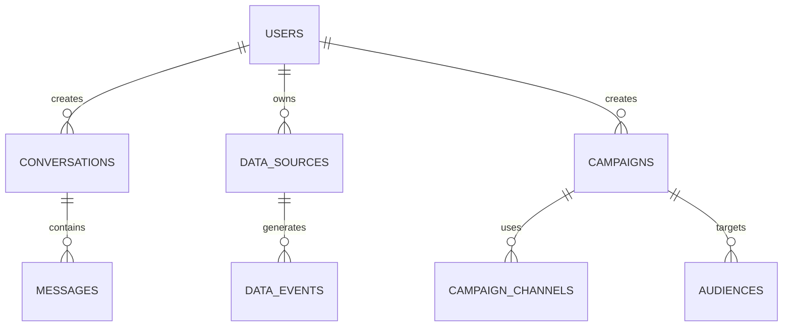

# Database Design

## Core Entity Relationships



## Core Tables

### Users & Authentication
```sql
-- Users table
CREATE TABLE users (
    id UUID PRIMARY KEY DEFAULT gen_random_uuid(),
    email VARCHAR(255) UNIQUE NOT NULL,
    password_hash VARCHAR(255) NOT NULL,
    first_name VARCHAR(100),
    last_name VARCHAR(100),
    company_name VARCHAR(255),
    is_verified BOOLEAN DEFAULT FALSE,
    last_login_at TIMESTAMP,
    created_at TIMESTAMP DEFAULT NOW(),
    updated_at TIMESTAMP DEFAULT NOW()
);

-- User sessions table for JWT token management
CREATE TABLE user_sessions (
    id UUID PRIMARY KEY DEFAULT gen_random_uuid(),
    user_id UUID REFERENCES users(id) ON DELETE CASCADE,
    refresh_token_hash VARCHAR(255) NOT NULL,
    access_token_jti VARCHAR(255) UNIQUE, -- JWT ID for access token
    expires_at TIMESTAMP NOT NULL,
    is_revoked BOOLEAN DEFAULT FALSE,
    ip_address INET,
    user_agent TEXT,
    created_at TIMESTAMP DEFAULT NOW(),
    updated_at TIMESTAMP DEFAULT NOW()
);

-- JWT token blacklist for logout functionality
CREATE TABLE token_blacklist (
    id UUID PRIMARY KEY DEFAULT gen_random_uuid(),
    jti VARCHAR(255) UNIQUE NOT NULL, -- JWT ID
    user_id UUID REFERENCES users(id) ON DELETE CASCADE,
    expires_at TIMESTAMP NOT NULL,
    created_at TIMESTAMP DEFAULT NOW()
);

### Data Sources & Conversations
```sql
-- Data sources table
CREATE TABLE data_sources (
    id UUID PRIMARY KEY DEFAULT gen_random_uuid(),
    user_id UUID REFERENCES users(id) ON DELETE CASCADE,
    source_type VARCHAR(50) NOT NULL, -- 'gtm', 'facebook_pixel', 'shopify'
    name VARCHAR(255) NOT NULL,
    config JSONB NOT NULL,
    status VARCHAR(20) DEFAULT 'active',
    last_sync_at TIMESTAMP,
    created_at TIMESTAMP DEFAULT NOW(),
    updated_at TIMESTAMP DEFAULT NOW()
);

-- Conversations table
CREATE TABLE conversations (
    id UUID PRIMARY KEY DEFAULT gen_random_uuid(),
    user_id UUID REFERENCES users(id) ON DELETE CASCADE,
    title VARCHAR(255),
    status VARCHAR(20) DEFAULT 'active',
    created_at TIMESTAMP DEFAULT NOW(),
    updated_at TIMESTAMP DEFAULT NOW()
);

-- Messages table
CREATE TABLE messages (
    id UUID PRIMARY KEY DEFAULT gen_random_uuid(),
    conversation_id UUID REFERENCES conversations(id),
    role VARCHAR(20) NOT NULL, -- 'user', 'assistant'
    content TEXT NOT NULL,
    metadata JSONB,
    created_at TIMESTAMP DEFAULT NOW()
);

### Campaigns & Channels
```sql
-- Campaigns table
CREATE TABLE campaigns (
    id UUID PRIMARY KEY DEFAULT gen_random_uuid(),
    user_id UUID REFERENCES users(id) ON DELETE CASCADE,
    conversation_id UUID REFERENCES conversations(id),
    name VARCHAR(255) NOT NULL,
    description TEXT,
    status VARCHAR(20) DEFAULT 'draft', -- 'draft', 'scheduled', 'running', 'paused', 'completed'
    scheduled_at TIMESTAMP,
    started_at TIMESTAMP,
    ended_at TIMESTAMP,
    config JSONB NOT NULL,
    created_at TIMESTAMP DEFAULT NOW(),
    updated_at TIMESTAMP DEFAULT NOW()
);

-- Campaign channels table
CREATE TABLE campaign_channels (
    id UUID PRIMARY KEY DEFAULT gen_random_uuid(),
    campaign_id UUID REFERENCES campaigns(id),
    channel_type VARCHAR(50) NOT NULL, -- 'email', 'sms', 'push', 'whatsapp'
    config JSONB NOT NULL,
    status VARCHAR(20) DEFAULT 'pending',
    sent_count INTEGER DEFAULT 0,
    delivered_count INTEGER DEFAULT 0,
    opened_count INTEGER DEFAULT 0,
    clicked_count INTEGER DEFAULT 0,
    created_at TIMESTAMP DEFAULT NOW(),
    updated_at TIMESTAMP DEFAULT NOW()
);
```
```
