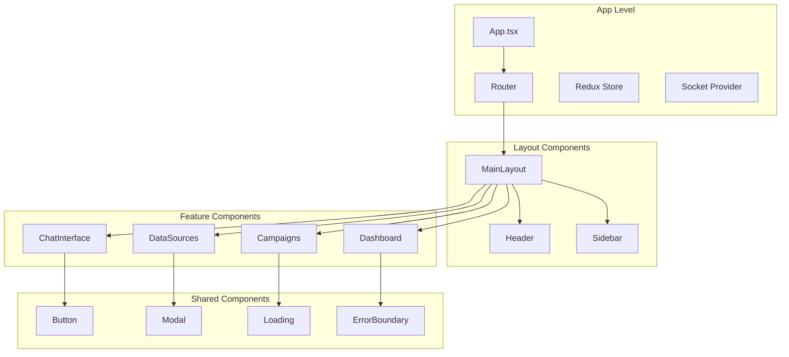

# Frontend Design

## Technology Stack
- **Framework**: React 18 with TypeScript
- **Styling**: Tailwind CSS + Headless UI
- **State Management**: Redux Toolkit + RTK Query
- **Real-time**: Socket.io-client
- **Routing**: React Router v6
- **Forms**: React Hook Form + Zod validation

## Component Architecture



## Key Components

### 1. Chat Interface
```typescript
// ChatInterface.tsx
interface ChatInterfaceProps {
  conversationId?: string;
  onCampaignCreate: (campaign: Campaign) => void;
}

// Message component
interface MessageProps {
  role: 'user' | 'assistant';
  content: string;
  timestamp: Date;
  metadata?: any;
}

// Streaming response handler
const useStreamingResponse = (conversationId: string) => {
  const [messages, setMessages] = useState<Message[]>([]);
  const [isStreaming, setIsStreaming] = useState(false);
  
  // Socket.io integration for real-time streaming
};
```

### 2. Data Sources Management
```typescript
// DataSourcesList.tsx
interface DataSource {
  id: string;
  type: 'gtm' | 'facebook_pixel' | 'shopify';
  name: string;
  status: 'connected' | 'disconnected' | 'error';
  lastSync: Date;
}

// Connection wizard
const ConnectionWizard = ({ sourceType }: { sourceType: string }) => {
  // Multi-step form for connecting data sources
};
```

### 3. Campaign Builder
```typescript
// CampaignBuilder.tsx
interface CampaignForm {
  name: string;
  description: string;
  channels: ChannelType[];
  audience: AudienceConfig;
  content: ContentConfig;
  schedule: ScheduleConfig;
}

// Channel-specific forms
const EmailChannelForm = ({ config, onChange }: ChannelFormProps) => {
  // Email template editor, subject line, etc.
};
```

## State Management

### Redux Store Structure
```typescript
interface RootState {
  auth: AuthState;
  user: UserState;
  conversations: ConversationsState;
  dataSources: DataSourcesState;
  campaigns: CampaignsState;
  ui: UIState;
}

interface AuthState {
  user: User | null;
  accessToken: string | null;
  refreshToken: string | null;
  isAuthenticated: boolean;
  isLoading: boolean;
  tokenExpiry: number | null;
}

interface UserState {
  profile: UserProfile;
  preferences: UserPreferences;
}

// RTK Query APIs
export const api = createApi({
  reducerPath: 'api',
  baseQuery: fetchBaseQuery({
    baseUrl: '/api/v1',
    prepareHeaders: (headers, { getState }) => {
      const accessToken = selectAccessToken(getState());
      if (accessToken) {
        headers.set('authorization', `Bearer ${accessToken}`);
      }
      return headers;
    },
  }),
  endpoints: (builder) => ({
    // Auth endpoints
    register: builder.mutation<AuthResponse, RegisterRequest>({
      query: (credentials) => ({
        url: 'auth/register',
        method: 'POST',
        body: credentials,
      }),
    }),
    login: builder.mutation<AuthResponse, LoginRequest>({
      query: (credentials) => ({
        url: 'auth/login',
        method: 'POST',
        body: credentials,
      }),
    }),
    refreshToken: builder.mutation<AuthResponse, RefreshTokenRequest>({
      query: (body) => ({
        url: 'auth/refresh',
        method: 'POST',
        body,
      }),
    }),
    logout: builder.mutation<void, LogoutRequest>({
      query: (body) => ({
        url: 'auth/logout',
        method: 'POST',
        body,
      }),
    }),
    
    // User endpoints
    getProfile: builder.query<UserProfile, void>({
      query: () => 'user/profile',
    }),
    
    // Conversation endpoints
    getConversations: builder.query<Conversation[], void>({
      query: () => 'conversations',
    }),
    sendMessage: builder.mutation<Message, SendMessageRequest>({
      query: ({ conversationId, content }) => ({
        url: `conversations/${conversationId}/messages`,
        method: 'POST',
        body: { content, role: 'user' },
      }),
    }),
    
    // Data sources endpoints
    getDataSources: builder.query<DataSource[], void>({
      query: () => 'data-sources',
    }),
    
    // Campaign endpoints
    getCampaigns: builder.query<Campaign[], void>({
      query: () => 'campaigns',
    }),
  }),
});
```

## Real-time Features

### Socket.io Integration
```typescript
// useSocket.ts
export const useSocket = () => {
  const socket = useRef<Socket>();
  
  useEffect(() => {
    socket.current = io(process.env.REACT_APP_SOCKET_URL!);
    
    socket.current.on('message_stream', (data) => {
      // Handle streaming AI responses
      dispatch(addStreamingMessage(data));
    });
    
    socket.current.on('campaign_update', (data) => {
      // Handle campaign status updates
      dispatch(updateCampaign(data));
    });
    
    return () => socket.current?.disconnect();
  }, []);
  
  return socket.current;
};
```

## UI/UX Design Principles

### 1. Perplexity-like Interface
- Clean, minimal chat interface
- Real-time message streaming
- Context-aware suggestions
- Smooth animations and transitions

### 2. Responsive Design
- Mobile-first approach
- Adaptive layouts for different screen sizes
- Touch-friendly interactions

### 3. Accessibility
- WCAG 2.1 AA compliance
- Keyboard navigation support
- Screen reader compatibility
- High contrast mode support

## Key Features Implementation

### 1. Message Streaming
```typescript
const MessageStream = ({ conversationId }: { conversationId: string }) => {
  const [streamingMessage, setStreamingMessage] = useState('');
  
  useEffect(() => {
    const eventSource = new EventSource(`/api/v1/conversations/${conversationId}/stream`);
    
    eventSource.onmessage = (event) => {
      const data = JSON.parse(event.data);
      if (data.type === 'chunk') {
        setStreamingMessage(prev => prev + data.content);
      }
    };
    
    return () => eventSource.close();
  }, [conversationId]);
  
  return <div>{streamingMessage}</div>;
};
```

### 2. Campaign Preview
```typescript
const CampaignPreview = ({ campaign }: { campaign: Campaign }) => {
  return (
    <div className="grid grid-cols-1 md:grid-cols-2 gap-4">
      {campaign.channels.map(channel => (
        <ChannelPreview 
          key={channel.type} 
          channel={channel} 
          content={campaign.content[channel.type]}
        />
      ))}
    </div>
  );
};
```

### 3. Data Source Status
```typescript
const DataSourceStatus = ({ source }: { source: DataSource }) => {
  const statusColors = {
    connected: 'text-green-500',
    disconnected: 'text-gray-500',
    error: 'text-red-500'
  };
  
  return (
    <div className="flex items-center space-x-2">
      <div className={`w-2 h-2 rounded-full ${statusColors[source.status]}`} />
      <span>{source.name}</span>
      <span className="text-sm text-gray-500">
        Last sync: {formatDate(source.lastSync)}
      </span>
    </div>
  );
};
```

## JWT Token Management

### Token Storage & Refresh Logic
```typescript
// Auth slice with token management
const authSlice = createSlice({
  name: 'auth',
  initialState: {
    user: null,
    accessToken: null,
    refreshToken: null,
    isAuthenticated: false,
    isLoading: false,
    tokenExpiry: null,
  },
  reducers: {
    setCredentials: (state, action) => {
      const { user, accessToken, refreshToken, expiresIn } = action.payload;
      state.user = user;
      state.accessToken = accessToken;
      state.refreshToken = refreshToken;
      state.isAuthenticated = true;
      state.tokenExpiry = Date.now() + (expiresIn * 1000);
      
      // Store in localStorage
      localStorage.setItem('accessToken', accessToken);
      localStorage.setItem('refreshToken', refreshToken);
    },
    logout: (state) => {
      state.user = null;
      state.accessToken = null;
      state.refreshToken = null;
      state.isAuthenticated = false;
      state.tokenExpiry = null;
      
      // Clear localStorage
      localStorage.removeItem('accessToken');
      localStorage.removeItem('refreshToken');
    },
  },
});

// Token refresh interceptor
const tokenRefreshInterceptor = async (error: any) => {
  const originalRequest = error.config;
  
  if (error.response?.status === 401 && !originalRequest._retry) {
    originalRequest._retry = true;
    
    const refreshToken = localStorage.getItem('refreshToken');
    if (refreshToken) {
      try {
        const response = await api.endpoints.refreshToken.initiate({
          refreshToken
        });
        
        const { accessToken, refreshToken: newRefreshToken } = response.data.tokens;
        
        // Update tokens in store
        dispatch(setCredentials({
          user: getState().auth.user,
          accessToken,
          refreshToken: newRefreshToken,
          expiresIn: 3600
        }));
        
        // Retry original request with new token
        originalRequest.headers.Authorization = `Bearer ${accessToken}`;
        return api(originalRequest);
      } catch (refreshError) {
        // Refresh failed, logout user
        dispatch(logout());
        window.location.href = '/login';
      }
    }
  }
  
  return Promise.reject(error);
};
```

### Protected Route Component
```typescript
const ProtectedRoute = ({ children }: { children: React.ReactNode }) => {
  const { isAuthenticated, isLoading } = useSelector((state: RootState) => state.auth);
  const [checkingToken, setCheckingToken] = useState(true);
  
  useEffect(() => {
    const checkAuth = async () => {
      const accessToken = localStorage.getItem('accessToken');
      const refreshToken = localStorage.getItem('refreshToken');
      
      if (accessToken && refreshToken) {
        try {
          // Verify token is still valid
          const response = await api.endpoints.getProfile.initiate();
          if (response.data) {
            dispatch(setCredentials({
              user: response.data,
              accessToken,
              refreshToken,
              expiresIn: 3600
            }));
          }
        } catch (error) {
          // Token invalid, try refresh
          try {
            const refreshResponse = await api.endpoints.refreshToken.initiate({
              refreshToken
            });
            
            dispatch(setCredentials({
              user: refreshResponse.data.user,
              accessToken: refreshResponse.data.tokens.accessToken,
              refreshToken: refreshResponse.data.tokens.refreshToken,
              expiresIn: refreshResponse.data.tokens.expiresIn
            }));
          } catch (refreshError) {
            // Both tokens invalid, redirect to login
            dispatch(logout());
          }
        }
      }
      setCheckingToken(false);
    };
    
    checkAuth();
  }, []);
  
  if (isLoading || checkingToken) {
    return <LoadingSpinner />;
  }
  
  if (!isAuthenticated) {
    return <Navigate to="/login" replace />;
  }
  
  return <>{children}</>;
};
```
