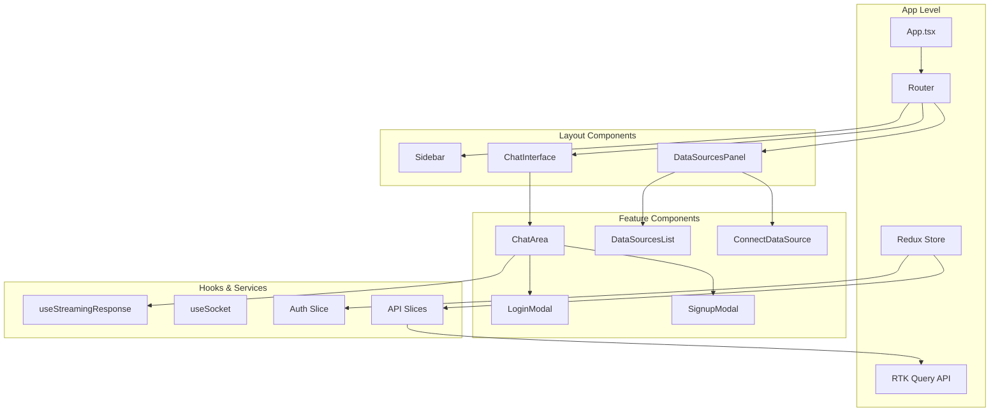

# Frontend Design

## Technology Stack
- **Framework**: React 18 with TypeScript
- **Build Tool**: Vite
- **Styling**: Tailwind CSS
- **State Management**: Redux Toolkit + RTK Query
- **Real-time**: Fetch API with Server-Sent Events (SSE)
- **Routing**: React Router v6
- **HTTP Client**: RTK Query with fetchBaseQuery

## Component Architecture



## Key Components

### 1. Chat Interface
```typescript
// ChatInterface.tsx
interface ChatInterfaceProps {
  conversationId?: string;
  onConversationCreated?: (id: string) => void;
}

// ChatArea component
interface ChatAreaProps {
  currentQuery: string;
  setCurrentQuery: (query: string) => void;
  conversationId?: string;
  onConversationCreated?: (id: string) => void;
}

// Message component
interface ChatMessage {
  id: string;
  role: 'user' | 'assistant';
  content: string;
  timestamp: string;
  conversationId?: string;
  metadata?: any;
}

// Streaming response handler
const useStreamingResponse = (conversationId: string, onComplete?: (message: string) => void) => {
  const [streamingMessage, setStreamingMessage] = useState('');
  const [isStreaming, setIsStreaming] = useState(false);
  const [campaignRecommendations, setCampaignRecommendations] = useState<any>(null);
  
  // Fetch API with SSE for real-time streaming
};
```

### 2. Data Sources Management
```typescript
// DataSourcesList.tsx
interface DataSource {
  id: string;
  userId: string;
  sourceType: 'gtm' | 'facebook_pixel' | 'shopify';
  name: string;
  config: Record<string, any>;
  isActive: boolean;
  createdAt: string;
  updatedAt: string;
}

// DataSourcesPanel component
const DataSourcesPanel = () => {
  // Main data sources management interface
};

// ConnectDataSource component
const ConnectDataSource = () => {
  // Data source connection interface
};
```

### 3. Authentication Components
```typescript
// LoginModal.tsx
interface LoginModalProps {
  isOpen: boolean;
  onClose: () => void;
  onSwitchToSignup: () => void;
}

// SignupModal.tsx
interface SignupModalProps {
  isOpen: boolean;
  onClose: () => void;
  onSwitchToLogin: () => void;
}

// Auth form data
interface LoginFormData {
  email: string;
  password: string;
}

interface SignupFormData {
  email: string;
  password: string;
  confirmPassword: string;
  firstName: string;
  lastName: string;
  companyName: string;
}
```

## State Management

### Redux Store Structure
```typescript
interface RootState {
  auth: AuthState;
  api: any; // RTK Query API state
}

interface AuthState {
  user: User | null;
  accessToken: string | null;
  refreshToken: string | null;
  isAuthenticated: boolean;
  isLoading: boolean;
  tokenExpiry: number | null;
}

interface User {
  id: string;
  email: string;
  firstName: string;
  lastName: string;
  companyName: string;
  createdAt: string;
}

// RTK Query APIs
export const authApi = createApi({
  reducerPath: 'authApi',
  baseQuery: fetchBaseQuery({
    baseUrl: `${import.meta.env.VITE_API_URL || 'http://localhost:5900'}`,
    prepareHeaders: (headers, { getState }) => {
      const token = (getState() as RootState).auth.accessToken;
      if (token) {
        headers.set('authorization', `Bearer ${token}`);
      }
      return headers;
    },
  }),
  endpoints: (builder) => ({
    register: builder.mutation<AuthResponse, RegisterRequest>({
      query: (credentials) => ({
        url: 'auth/register',
        method: 'POST',
        body: credentials,
      }),
    }),
    login: builder.mutation<AuthResponse, LoginRequest>({
      query: (credentials) => ({
        url: 'auth/login',
        method: 'POST',
        body: credentials,
      }),
    }),
    refreshToken: builder.mutation<AuthResponse, RefreshTokenRequest>({
      query: (body) => ({
        url: 'auth/refresh',
        method: 'POST',
        body,
      }),
    }),
    logout: builder.mutation<void, LogoutRequest>({
      query: (body) => ({
        url: 'auth/logout',
        method: 'POST',
        body,
      }),
    }),
  }),
});

export const chatApi = createApi({
  reducerPath: 'chatApi',
  baseQuery: fetchBaseQuery({
    baseUrl: `${import.meta.env.VITE_API_URL || 'http://localhost:5900'}`,
    prepareHeaders: (headers, { getState }) => {
      const token = (getState() as RootState).auth.accessToken;
      if (token) {
        headers.set('authorization', `Bearer ${token}`);
      }
      return headers;
    },
  }),
  endpoints: (builder) => ({
    createConversation: builder.mutation<Conversation, CreateConversationRequest>({
      query: (body) => ({
        url: 'conversations',
        method: 'POST',
        body,
      }),
    }),
    getConversation: builder.query<Conversation, string>({
      query: (id) => `conversations/${id}`,
    }),
    sendMessage: builder.mutation<Message, SendMessageRequest>({
      query: ({ conversationId, content, role }) => ({
        url: `conversations/${conversationId}/messages`,
        method: 'POST',
        body: { content, role },
      }),
    }),
  }),
});

export const dataSourcesApi = createApi({
  reducerPath: 'dataSourcesApi',
  baseQuery: fetchBaseQuery({
    baseUrl: `${import.meta.env.VITE_API_URL || 'http://localhost:5900'}`,
    prepareHeaders: (headers, { getState }) => {
      const token = (getState() as RootState).auth.accessToken;
      if (token) {
        headers.set('authorization', `Bearer ${token}`);
      }
      return headers;
    },
  }),
  endpoints: (builder) => ({
    getDataSources: builder.query<DataSource[], void>({
      query: () => 'data-sources',
    }),
    createDataSource: builder.mutation<DataSource, CreateDataSourceRequest>({
      query: (body) => ({
        url: 'data-sources',
        method: 'POST',
        body,
      }),
    }),
    addDummyData: builder.mutation<any, string>({
      query: (sourceType) => ({
        url: `data-sources/dummy-data/bulk/${sourceType}`,
        method: 'POST',
      }),
    }),
  }),
});
```

## Real-time Features

### Server-Sent Events (SSE) Integration
```typescript
// useStreamingResponse.ts
export const useStreamingResponse = (conversationId: string, onComplete?: (message: string) => void) => {
  const [streamingMessage, setStreamingMessage] = useState('');
  const [isStreaming, setIsStreaming] = useState(false);
  const [campaignRecommendations, setCampaignRecommendations] = useState<any>(null);
  const accessToken = useSelector((state: RootState) => state.auth.accessToken);

  const startStreaming = async () => {
    const response = await fetch(`${import.meta.env.VITE_API_URL}/conversations/${conversationId}/stream`, {
      headers: {
        'Authorization': accessToken ? `Bearer ${accessToken}` : '',
        'Accept': 'text/event-stream',
      },
    });

    const reader = response.body?.getReader();
    const decoder = new TextDecoder();

    while (true) {
      const { done, value } = await reader.read();
      if (done) break;

      const chunk = decoder.decode(value);
      const lines = chunk.split('\n');

      for (const line of lines) {
        if (line.startsWith('data: ')) {
          const data = JSON.parse(line.slice(6));
          // Handle different message types
        }
      }
    }
  };
};
```

## UI/UX Design Principles

### 1. Perplexity-like Interface
- Clean, minimal chat interface
- Real-time message streaming
- Context-aware suggestions
- Smooth animations and transitions

### 2. Responsive Design
- Mobile-first approach
- Adaptive layouts for different screen sizes
- Touch-friendly interactions

### 3. Accessibility
- WCAG 2.1 AA compliance
- Keyboard navigation support
- Screen reader compatibility
- High contrast mode support

## Key Features Implementation

### 1. Message Streaming
```typescript
// Actual implementation uses fetch API with SSE parsing
const useStreamingResponse = (conversationId: string) => {
  const [streamingMessage, setStreamingMessage] = useState('');
  const [isStreaming, setIsStreaming] = useState(false);
  
  const startStreaming = async () => {
    const response = await fetch(`/conversations/${conversationId}/stream`, {
      headers: { 'Authorization': `Bearer ${token}` }
    });
    
    const reader = response.body?.getReader();
    const decoder = new TextDecoder();
    
    // Parse SSE chunks and update streaming message
  };
};
```

### 2. Campaign Recommendations Display
```typescript
// Campaign recommendations are displayed in ChatArea component
// Shows multiple campaigns with audience segments and channel recommendations
const CampaignRecommendations = ({ recommendations }: { recommendations: any }) => {
  return (
    <div className="space-y-4">
      {recommendations.data.campaigns.map((campaign: any, index: number) => (
        <div key={campaign.id || index} className="bg-gradient-to-r from-purple-50 to-blue-50 border border-purple-200 rounded-lg p-4">
          <h6 className="font-medium text-purple-900">{campaign.name}</h6>
          {/* Audience and channel information */}
        </div>
      ))}
    </div>
  );
};
```

## JWT Token Management

### Token Storage & Refresh Logic
```typescript
// Auth slice with token management
const authSlice = createSlice({
  name: 'auth',
  initialState: {
    user: null,
    accessToken: null,
    refreshToken: null,
    isAuthenticated: false,
    isLoading: false,
    tokenExpiry: null,
  },
  reducers: {
    setCredentials: (state, action) => {
      const { user, accessToken, refreshToken, expiresIn } = action.payload;
      state.user = user;
      state.accessToken = accessToken;
      state.refreshToken = refreshToken;
      state.isAuthenticated = true;
      state.tokenExpiry = Date.now() + (expiresIn * 1000);
      
      // Store in localStorage
      localStorage.setItem('accessToken', accessToken);
      localStorage.setItem('refreshToken', refreshToken);
    },
    logout: (state) => {
      state.user = null;
      state.accessToken = null;
      state.refreshToken = null;
      state.isAuthenticated = false;
      state.tokenExpiry = null;
      
      // Clear localStorage
      localStorage.removeItem('accessToken');
      localStorage.removeItem('refreshToken');
    },
  },
});

// Token refresh interceptor
const tokenRefreshInterceptor = async (error: any) => {
  const originalRequest = error.config;
  
  if (error.response?.status === 401 && !originalRequest._retry) {
    originalRequest._retry = true;
    
    const refreshToken = localStorage.getItem('refreshToken');
    if (refreshToken) {
      try {
        const response = await api.endpoints.refreshToken.initiate({
          refreshToken
        });
        
        const { accessToken, refreshToken: newRefreshToken } = response.data.tokens;
        
        // Update tokens in store
        dispatch(setCredentials({
          user: getState().auth.user,
          accessToken,
          refreshToken: newRefreshToken,
          expiresIn: 3600
        }));
        
        // Retry original request with new token
        originalRequest.headers.Authorization = `Bearer ${accessToken}`;
        return api(originalRequest);
      } catch (refreshError) {
        // Refresh failed, logout user
        dispatch(logout());
        window.location.href = '/login';
      }
    }
  }
  
  return Promise.reject(error);
};
```

### Protected Route Component
```typescript
const ProtectedRoute = ({ children }: { children: React.ReactNode }) => {
  const { isAuthenticated, isLoading } = useSelector((state: RootState) => state.auth);
  const [checkingToken, setCheckingToken] = useState(true);
  
  useEffect(() => {
    const checkAuth = async () => {
      const accessToken = localStorage.getItem('accessToken');
      const refreshToken = localStorage.getItem('refreshToken');
      
      if (accessToken && refreshToken) {
        try {
          // Verify token is still valid
          const response = await api.endpoints.getProfile.initiate();
          if (response.data) {
            dispatch(setCredentials({
              user: response.data,
              accessToken,
              refreshToken,
              expiresIn: 3600
            }));
          }
        } catch (error) {
          // Token invalid, try refresh
          try {
            const refreshResponse = await api.endpoints.refreshToken.initiate({
              refreshToken
            });
            
            dispatch(setCredentials({
              user: refreshResponse.data.user,
              accessToken: refreshResponse.data.tokens.accessToken,
              refreshToken: refreshResponse.data.tokens.refreshToken,
              expiresIn: refreshResponse.data.tokens.expiresIn
            }));
          } catch (refreshError) {
            // Both tokens invalid, redirect to login
            dispatch(logout());
          }
        }
      }
      setCheckingToken(false);
    };
    
    checkAuth();
  }, []);
  
  if (isLoading || checkingToken) {
    return <LoadingSpinner />;
  }
  
  if (!isAuthenticated) {
    return <Navigate to="/login" replace />;
  }
  
  return <>{children}</>;
};
```

## Current Implementation Features

### Authentication Flow
- Login/Signup modals with form validation
- JWT token management with refresh tokens
- Auto-login after signup
- Persistent authentication state

### Chat Interface
- Real-time message streaming via SSE
- Intent analysis and authentication prompts
- Campaign recommendation display
- Dummy data generation for testing

### Data Sources
- Connect data sources (GTM, Facebook Pixel, Shopify)
- Generate dummy data for testing
- Data source status management
