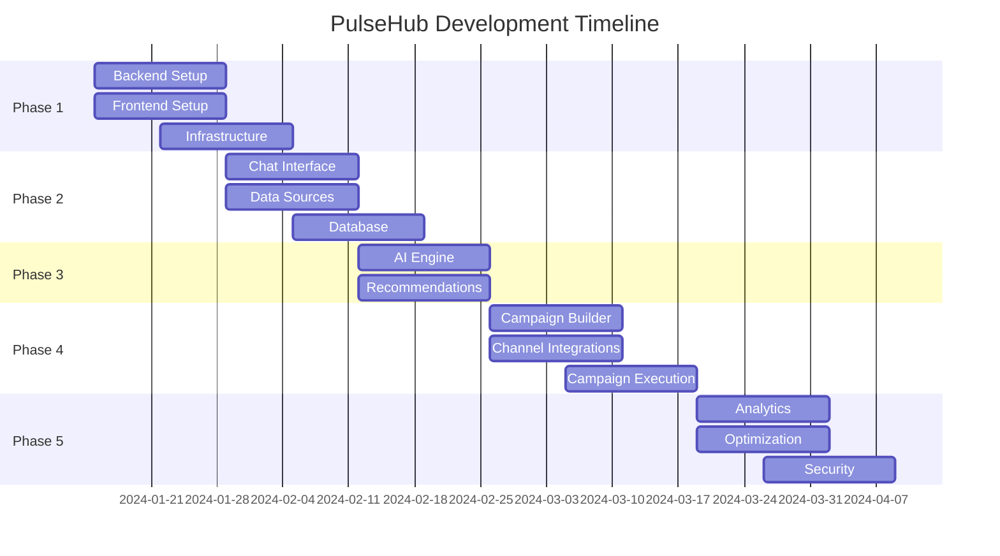

# Implementation Roadmap

## Phase 1: Foundation (Weeks 1-4)

### Backend Setup
- [ ] Project initialization with Node.js + Express
- [ ] PostgreSQL database setup and migrations
- [ ] Redis configuration for caching
- [ ] Basic authentication system (JWT)
- [ ] API gateway setup with rate limiting

### Frontend Setup
- [ ] React + TypeScript project initialization
- [ ] Tailwind CSS configuration
- [ ] Redux Toolkit setup
- [ ] React Router configuration
- [ ] Basic layout components

### Infrastructure
- [ ] Docker containerization
- [ ] CI/CD pipeline setup
- [ ] Basic monitoring (Prometheus + Grafana)
- [ ] Environment configuration

## Phase 2: Core Features (Weeks 5-8)

### Chat Interface
- [ ] WebSocket implementation (Socket.io)
- [ ] Message streaming functionality
- [ ] Conversation management
- [ ] Basic AI integration (OpenAI API)

### Data Sources Integration
- [ ] GTM API integration
- [ ] Facebook Pixel API integration
- [ ] Shopify API integration
- [ ] Data validation and transformation
- [ ] Real-time data sync

### Database Implementation
- [ ] Complete schema implementation
- [ ] Database indexes optimization
- [ ] Data migration scripts
- [ ] Backup and recovery procedures

## Phase 3: AI & Recommendations (Weeks 9-12)

### AI Engine Development
- [ ] Natural language processing pipeline
- [ ] Customer segmentation models
- [ ] Channel optimization algorithms
- [ ] Timing prediction models
- [ ] Content generation system

### Recommendation System
- [ ] Real-time data analysis
- [ ] Campaign suggestion engine
- [ ] A/B testing framework
- [ ] Performance prediction models

## Phase 4: Campaign Management (Weeks 13-16)

### Campaign Builder
- [ ] Multi-channel campaign creation
- [ ] Template system
- [ ] Audience segmentation tools
- [ ] Scheduling system
- [ ] Preview functionality

### Channel Integrations
- [ ] Email service (SendGrid)
- [ ] SMS service (Twilio)
- [ ] Push notifications (Firebase)
- [ ] WhatsApp Business API

### Campaign Execution
- [ ] Campaign deployment system
- [ ] Real-time monitoring
- [ ] Performance tracking
- [ ] Error handling and recovery

## Phase 5: Advanced Features (Weeks 17-20)

### Analytics & Reporting
- [ ] Real-time dashboard
- [ ] Performance metrics
- [ ] ROI calculations
- [ ] Custom reporting

### Optimization
- [ ] Machine learning model training
- [ ] Performance optimization
- [ ] Caching strategies
- [ ] Database query optimization

### Security & Compliance
- [ ] Data encryption
- [ ] GDPR compliance
- [ ] Security audits
- [ ] Penetration testing

## Technical Specifications

### Performance Requirements
- **Response Time**: < 200ms for API calls
- **Throughput**: 1000+ concurrent users
- **Uptime**: 99.9% availability
- **Data Processing**: Real-time with < 1s latency

### Security Requirements
- **Authentication**: JWT with refresh tokens
- **Authorization**: Role-based access control
- **Data Encryption**: AES-256 for data at rest
- **Transport**: TLS 1.3 for data in transit

### Scalability Requirements
- **Horizontal Scaling**: Auto-scaling based on load
- **Database**: Read replicas for query distribution
- **Caching**: Multi-layer caching strategy
- **CDN**: Global content delivery

## Development Timeline

## Risk Mitigation

### Technical Risks
- **AI Model Performance**: Implement fallback mechanisms
- **Data Source Reliability**: Circuit breakers and retry logic
- **Scalability Issues**: Load testing and performance monitoring
- **Security Vulnerabilities**: Regular security audits

### Business Risks
- **Market Competition**: Focus on unique AI-powered features
- **User Adoption**: Comprehensive onboarding and documentation
- **Data Privacy**: Strict compliance with regulations
- **Cost Management**: Efficient resource utilization

## Success Metrics

### Technical Metrics
- System uptime: > 99.9%
- API response time: < 200ms
- Data processing latency: < 1s
- Error rate: < 0.1%

### Business Metrics
- User engagement: Daily active users
- Campaign success rate: > 15% improvement
- Customer satisfaction: > 4.5/5 rating
- Revenue growth: 20% month-over-month
