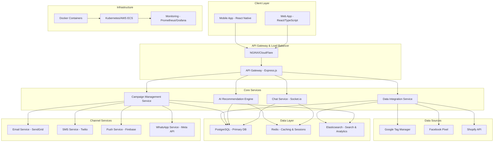
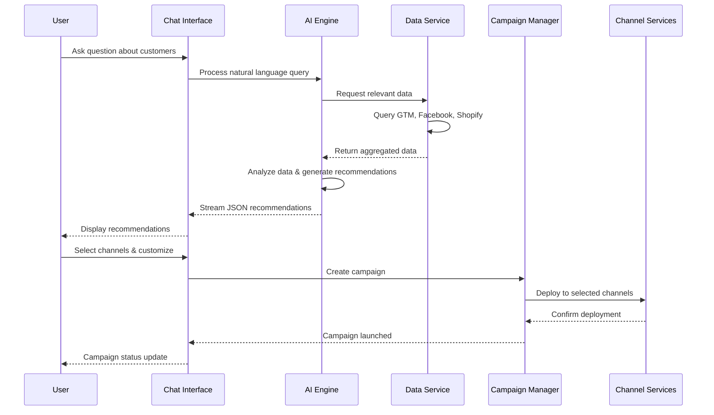

# System Design - High Level Architecture

## Overview

PulseHub is a real-time, AI-powered marketing platform that connects multiple data sources and enables multi-channel campaign execution through an intuitive chat interface.

## High-Level System Architecture

## Core Components

### 1. Chat Interface Service
- **Technology**: Socket.io, Node.js
- **Purpose**: Real-time chat communication
- **Features**: Message streaming, typing indicators, conversation history

### 2. AI Recommendation Engine
- **Technology**: OpenAI GPT-4, Custom ML models
- **Purpose**: Generate contextual marketing recommendations
- **Features**: Natural language processing, data analysis, campaign suggestions

### 3. Data Integration Service
- **Technology**: Node.js, REST APIs, Webhooks
- **Purpose**: Connect and sync with external data sources
- **Features**: Real-time data ingestion, data transformation, error handling

### 4. Campaign Management Service
- **Technology**: Node.js, Express
- **Purpose**: Create, schedule, and execute marketing campaigns
- **Features**: Multi-channel deployment, A/B testing, performance tracking

## Data Flow

## Technology Stack

### Backend
- **Runtime**: Node.js 18+
- **Framework**: Express.js
- **Real-time**: Socket.io
- **Database**: PostgreSQL 14+
- **Cache**: Redis 6+
- **Search**: Elasticsearch 8+

### Frontend
- **Framework**: React 18
- **Language**: TypeScript
- **Styling**: Tailwind CSS
- **State**: Redux Toolkit
- **Real-time**: Socket.io-client

### Infrastructure
- **Containerization**: Docker
- **Orchestration**: Kubernetes
- **Cloud**: AWS/GCP
- **CDN**: CloudFlare
- **Monitoring**: Prometheus + Grafana

## Scalability Considerations

### Horizontal Scaling
- Microservices architecture
- Stateless services
- Load balancing across multiple instances
- Database read replicas

### Performance Optimization
- Redis caching layer
- CDN for static assets
- Database indexing and query optimization
- Connection pooling

### Reliability
- Circuit breakers for external services
- Retry mechanisms with exponential backoff
- Graceful degradation
- Health checks and monitoring
