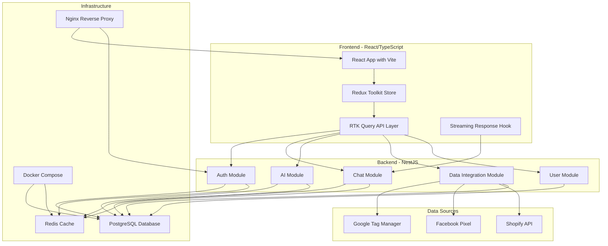
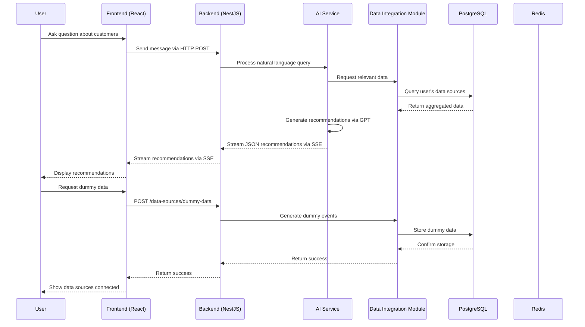
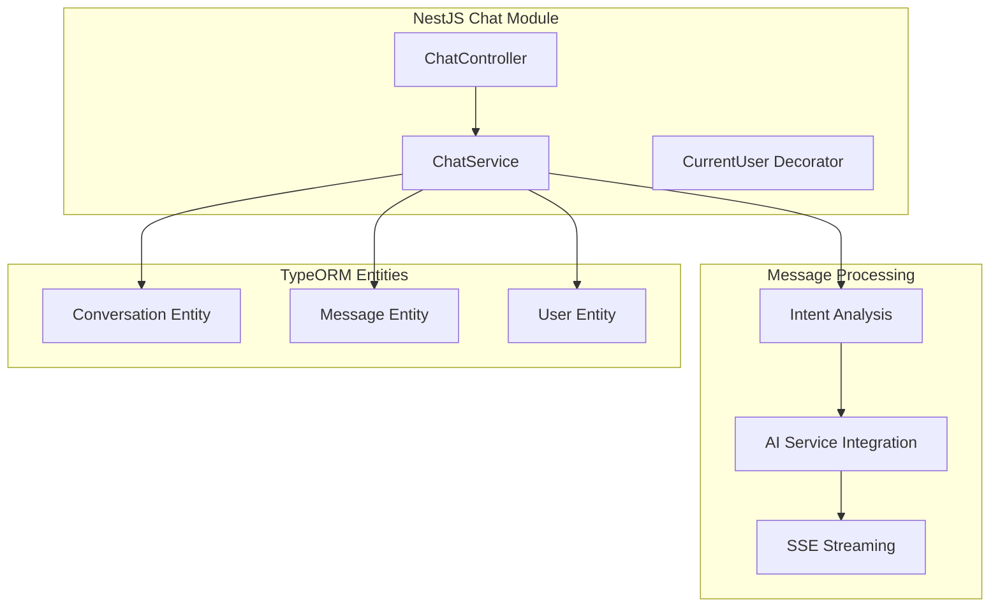
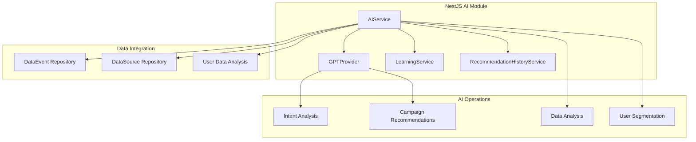
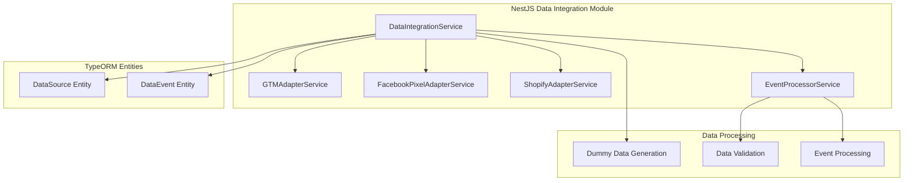
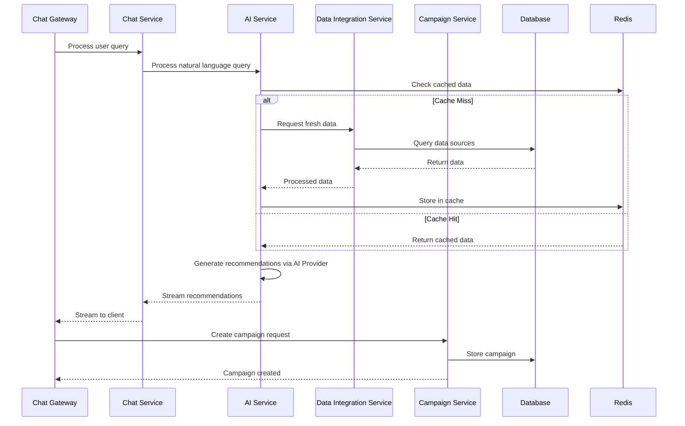
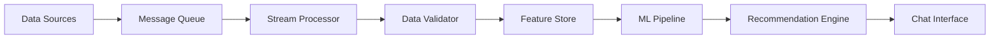
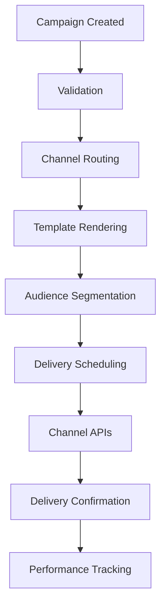

# System Design - High Level Architecture

## Overview

PulseHub is a real-time, AI-powered marketing platform that connects multiple data sources and enables multi-channel campaign execution through an intuitive chat interface. The system is built with NestJS backend and React frontend, using Docker for containerization.

## High-Level System Architecture

## Core NestJS Modules

### 1. Auth Module
- **Purpose**: User authentication and authorization
- **Features**: JWT tokens, user registration/login, session management, token refresh
- **Components**: AuthController, AuthService, JwtStrategy, UserEntity, UserSession, TokenBlacklist
- **Endpoints**: `/auth/register`, `/auth/login`, `/auth/refresh`, `/auth/logout`

### 2. Chat Module
- **Purpose**: Real-time chat communication with AI streaming
- **Features**: Message streaming via SSE, conversation management, intent analysis
- **Components**: ChatController, ChatService, ConversationEntity, MessageEntity
- **Endpoints**: `/conversations`, `/conversations/:id/messages`, `/conversations/:id/stream`

### 3. AI Module
- **Purpose**: Generate contextual marketing recommendations using AI
- **Features**: Intent analysis, campaign recommendations, data analysis, streaming responses
- **Components**: AIService, GPTProvider, LearningService, RecommendationHistoryService
- **Endpoints**: `/ai/providers`, `/ai/recommendations/history`, `/ai/recommendations/:id/feedback`

### 4. Data Integration Module
- **Purpose**: Connect and sync with external data sources
- **Features**: Data source management, dummy data generation, OAuth integration
- **Components**: DataIntegrationService, GTMAdapterService, FacebookPixelAdapterService, ShopifyAdapterService, OAuthService
- **Endpoints**: `/data-sources`, `/data-sources/dummy-data`, `/oauth/:provider`

### 5. User Module
- **Purpose**: User profile management
- **Features**: User profile retrieval and updates
- **Components**: UserController, UserService
- **Endpoints**: `/user/profile`

## Data Flow

## Technology Stack

### Backend
- **Runtime**: Node.js 20+
- **Framework**: NestJS
- **ORM**: TypeORM
- **Real-time**: Server-Sent Events (SSE)
- **Database**: PostgreSQL 15+
- **Cache**: Redis 7+
- **AI**: OpenAI GPT-4o-mini
- **Authentication**: JWT with refresh tokens

### Frontend
- **Framework**: React 18
- **Language**: TypeScript
- **Build Tool**: Vite
- **Styling**: Tailwind CSS
- **State**: Redux Toolkit + RTK Query
- **Real-time**: Fetch API with SSE
- **Routing**: React Router v6

### Infrastructure
- **Containerization**: Docker + Docker Compose
- **Database**: PostgreSQL with TypeORM synchronize
- **Caching**: Redis
- **Reverse Proxy**: Nginx
- **Development**: Docker-based local environment

## Current Implementation Architecture

### 1. Chat Service (NestJS)

**Key Features:**
- Real-time message streaming with SSE
- Intent analysis for authentication prompts
- AI-powered campaign recommendations
- Anonymous user support

### 2. AI Module Architecture (NestJS)

**Components:**
- **AIService**: Main service that orchestrates AI operations and data analysis
- **GPTProvider**: OpenAI GPT-4o-mini integration for intent analysis and recommendations
- **LearningService**: Handles feedback collection and model improvement
- **RecommendationHistoryService**: Tracks recommendations and outcomes

### 3. Data Integration Service (NestJS)

**Data Flow:**
1. **Dummy Data Generation**: Create synthetic data for testing
2. **Data Validation**: Validate event data structure
3. **Event Processing**: Store events in database
4. **Data Analysis**: Analyze user data for AI recommendations

## Current Implementation Status

### Implemented Features
- ✅ User authentication (JWT with refresh tokens)
- ✅ Chat interface with SSE streaming
- ✅ AI intent analysis and campaign recommendations
- ✅ Data source management and dummy data generation
- ✅ Docker Compose setup with PostgreSQL and Redis
- ✅ Real-time message streaming
- ✅ Anonymous user support

### Not Yet Implemented
- ❌ Campaign execution and deployment
- ❌ Channel-specific handlers (Email, SMS, Push, WhatsApp)
- ❌ Real-time campaign monitoring
- ❌ Performance analytics dashboard
- ❌ A/B testing capabilities
- ❌ Advanced user segmentation

## NestJS Module Communication

### Inter-Module Communication

## Data Flow Patterns

### 1. Real-time Data Processing

### 2. Campaign Execution Flow

## Scalability Considerations

### Performance Optimization
- Redis caching layer
- Database indexing and query optimization
- Connection pooling with TypeORM
- Efficient NestJS module communication

### Reliability
- Circuit breakers for external services
- Retry mechanisms with exponential backoff
- Graceful degradation
- Error handling and logging

### Development
- Modular NestJS architecture
- TypeORM for database operations
- Local development environment
- Docker for containerization
