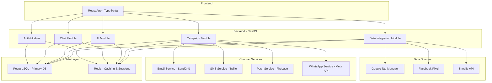
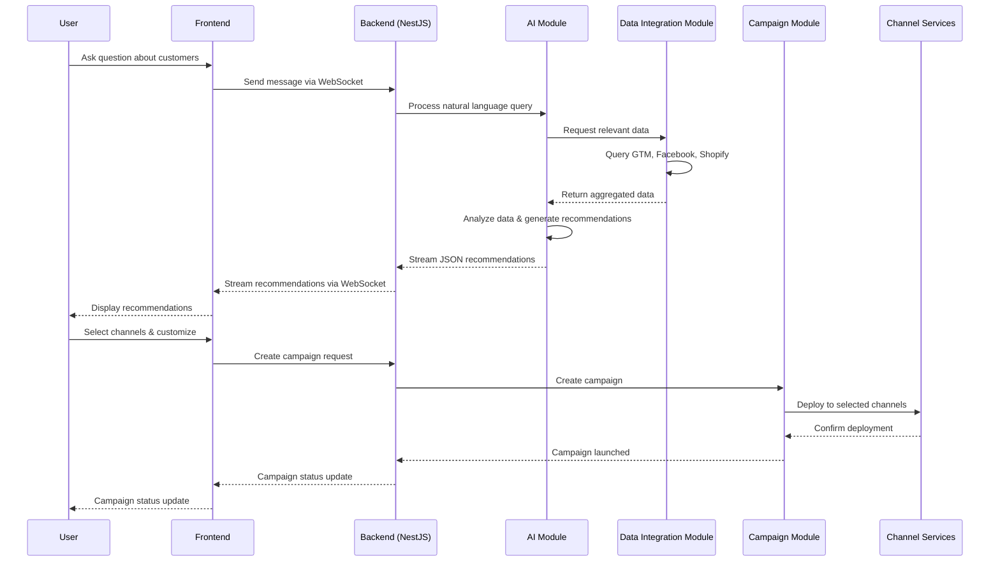
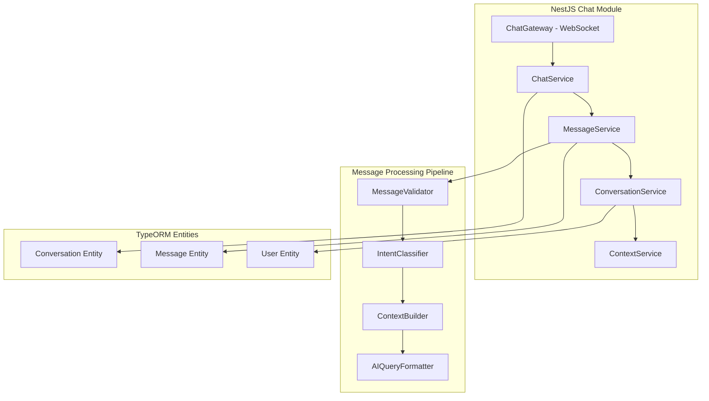
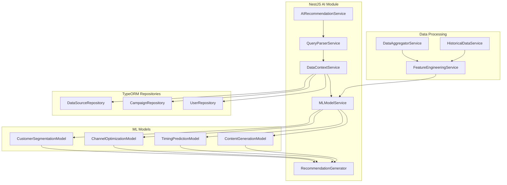
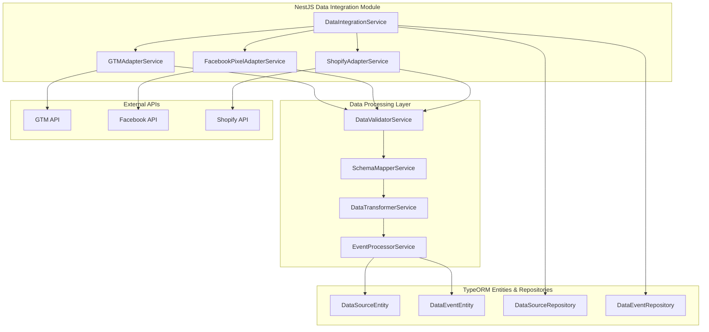
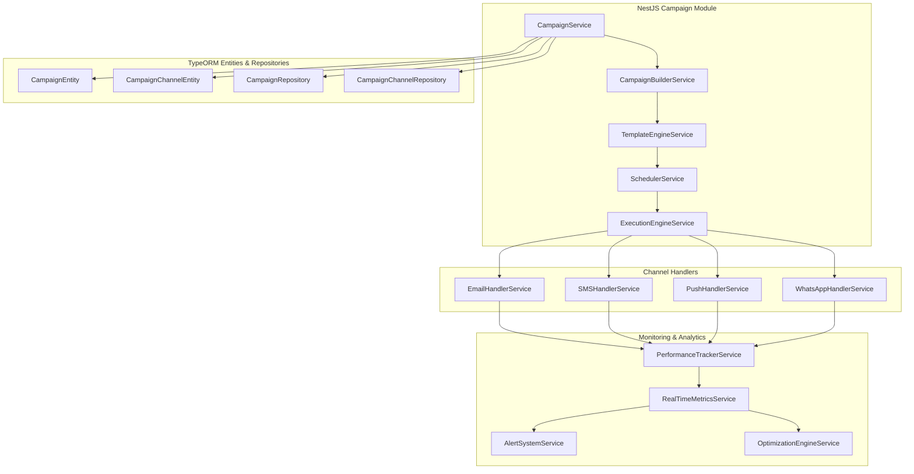
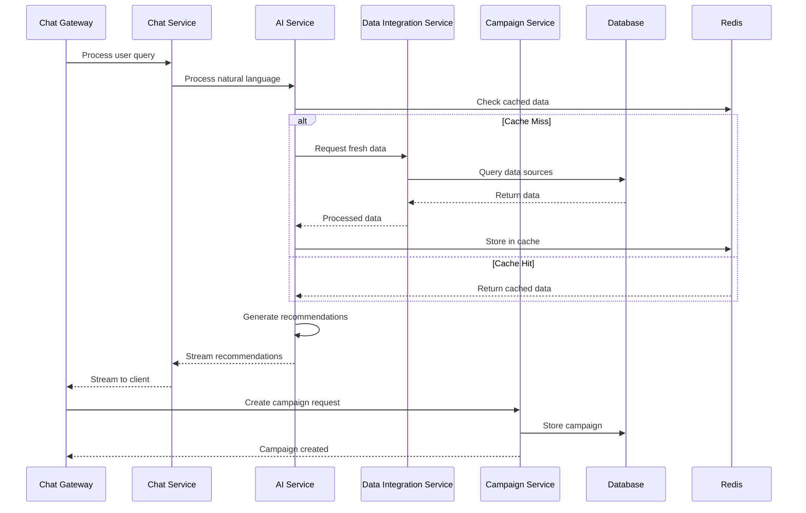
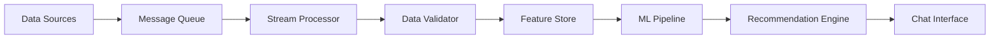
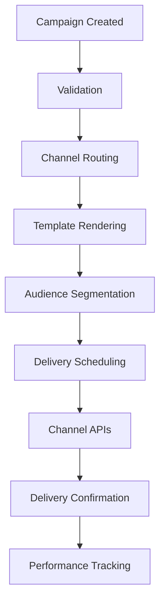

# System Design - High Level Architecture

## Overview

PulseHub is a real-time, AI-powered marketing platform that connects multiple data sources and enables multi-channel campaign execution through an intuitive chat interface.

## High-Level System Architecture

## Core NestJS Modules

### 1. Auth Module
- **Purpose**: User authentication and authorization
- **Features**: JWT tokens, user registration/login, session management
- **Components**: AuthController, AuthService, JwtStrategy, UserEntity

### 2. Chat Module
- **Purpose**: Real-time chat communication
- **Features**: Message streaming, typing indicators, conversation history
- **Components**: ChatGateway, ChatService, MessageService, ConversationEntity

### 3. AI Module
- **Purpose**: Generate contextual marketing recommendations
- **Features**: Natural language processing, data analysis, campaign suggestions
- **Components**: AIRecommendationService, QueryParserService, MLModelService

### 4. Data Integration Module
- **Purpose**: Connect and sync with external data sources
- **Features**: Real-time data ingestion, data transformation, error handling
- **Components**: DataIntegrationService, GTMAdapterService, FacebookPixelAdapterService, ShopifyAdapterService

### 5. Campaign Module
- **Purpose**: Create, schedule, and execute marketing campaigns
- **Features**: Multi-channel deployment, A/B testing, performance tracking
- **Components**: CampaignService, CampaignBuilderService, ChannelHandlerService

## Data Flow

## Technology Stack

### Backend
- **Runtime**: Node.js 18+
- **Framework**: NestJS
- **ORM**: TypeORM
- **Real-time**: Socket.io
- **Database**: PostgreSQL 14+
- **Cache**: Redis 6+
- **Search**: Elasticsearch 8+

### Frontend
- **Framework**: React 18
- **Language**: TypeScript
- **Styling**: Tailwind CSS
- **State**: Redux Toolkit
- **Real-time**: Socket.io-client

### Infrastructure
- **Containerization**: Docker
- **Database**: PostgreSQL with TypeORM
- **Caching**: Redis
- **Development**: Local development environment

## Detailed Component Architecture

### 1. Chat Service Deep Dive (NestJS)

**Key Features:**
- Real-time message streaming with WebSocket
- Conversation context management
- Message queuing for reliability
- Intent classification for routing

### 2. AI Recommendation Engine Architecture (NestJS)

**Components:**
- **Query Parser**: Extracts intent and entities from natural language
- **Data Context Builder**: Aggregates relevant data from connected sources
- **ML Pipeline**: Processes data through multiple specialized models
- **Recommendation Generator**: Creates actionable campaign suggestions

### 3. Data Integration Service Details (NestJS)

**Data Flow:**
1. **Ingestion**: Real-time data from APIs and webhooks
2. **Validation**: Schema validation and data quality checks
3. **Transformation**: Normalize data into common format
4. **Storage**: Store in appropriate data stores
5. **Processing**: Real-time analytics and feature generation

### 4. Campaign Management Service Architecture (NestJS)

## NestJS Module Communication

### Inter-Module Communication

## Data Flow Patterns

### 1. Real-time Data Processing

### 2. Campaign Execution Flow

## Scalability Considerations

### Performance Optimization
- Redis caching layer
- Database indexing and query optimization
- Connection pooling with TypeORM
- Efficient NestJS module communication

### Reliability
- Circuit breakers for external services
- Retry mechanisms with exponential backoff
- Graceful degradation
- Error handling and logging

### Development
- Modular NestJS architecture
- TypeORM for database operations
- Local development environment
- Docker for containerization
