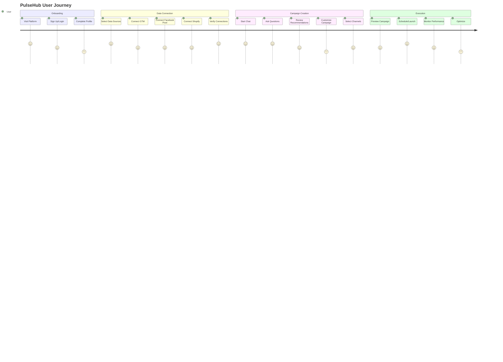
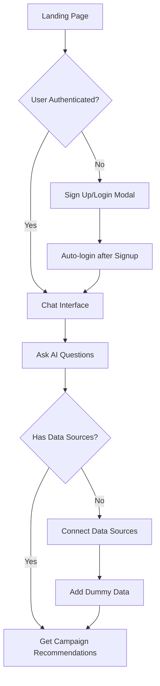
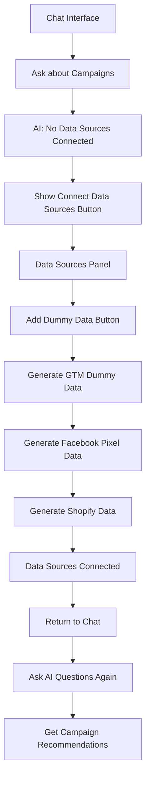
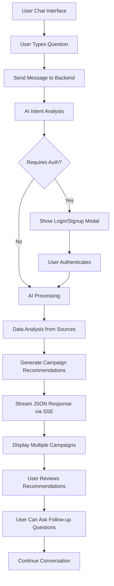
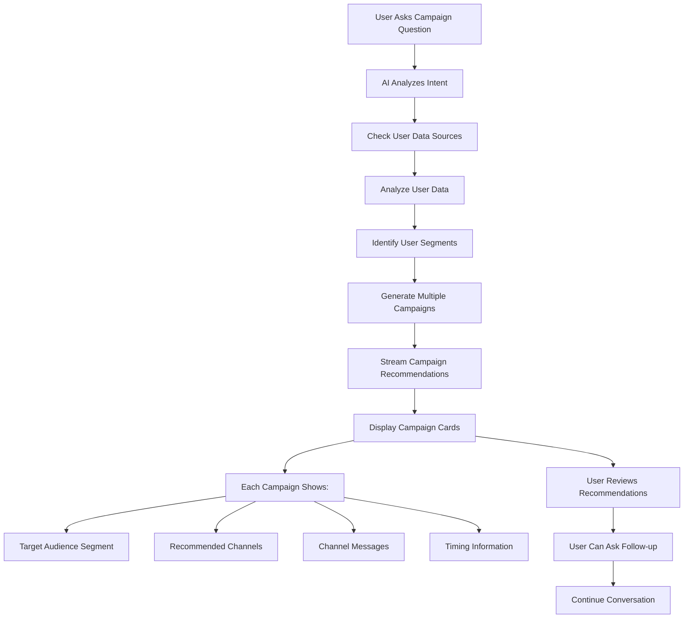

# User Flow Documentation

## Overview

This document outlines the complete user journey through the PulseHub platform, from initial onboarding to campaign execution and monitoring.

## User Journey Map

## Detailed User Flows

### 1. Onboarding Flow

### 2. Data Source Connection Flow

### 3. Chat Interface Flow

### 4. Campaign Recommendation Flow

## Current User Experience

### Anonymous Users
- Can ask general questions in chat
- See authentication prompts for advanced features
- Can sign up or log in via modals

### Authenticated Users
- Full access to chat interface
- Can connect data sources and generate dummy data
- Receive AI-powered campaign recommendations
- Can ask follow-up questions about recommendations

## Current User Interactions

### 1. Chat Interface
- Ask questions about marketing campaigns
- Receive AI-powered recommendations
- View multiple campaign suggestions with audience segments
- See channel-specific recommendations (email, SMS, push, WhatsApp)

### 2. Data Sources
- Connect GTM, Facebook Pixel, and Shopify
- Generate dummy data for testing
- View connected data sources status

### 3. Authentication
- Sign up with email and password
- Login with existing credentials
- Auto-login after signup
- Persistent session management

## Current Error Handling

### Authentication Errors
- Clear error messages for invalid credentials
- Token expiration handling with refresh
- Graceful fallback to anonymous mode

### Data Source Errors
- Validation of data source configurations
- Error messages for failed connections
- Fallback to dummy data generation

### AI Service Errors
- Fallback responses when AI is unavailable
- Clear error messages for API failures
- Graceful degradation of features

## Current Success Metrics

### User Engagement
- Chat message frequency
- Authentication conversion rate
- Data source connection rate

### System Performance
- API response times
- Database query performance
- SSE streaming reliability

