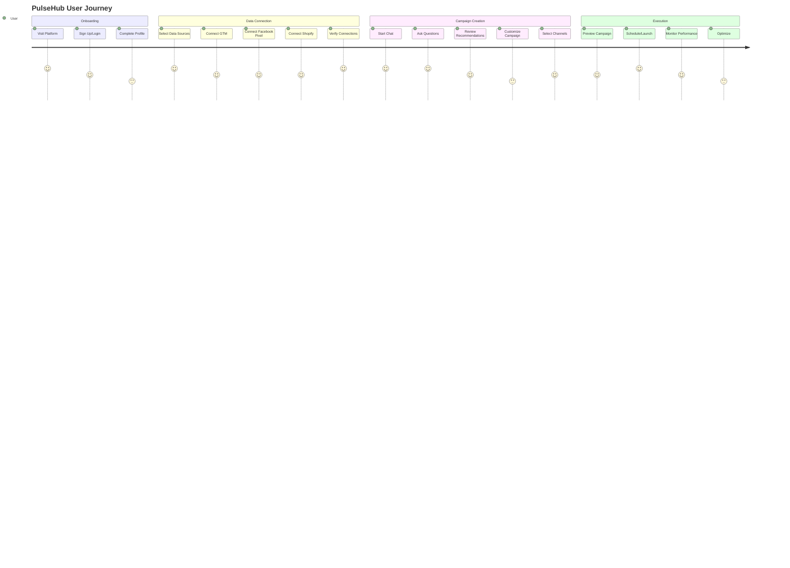
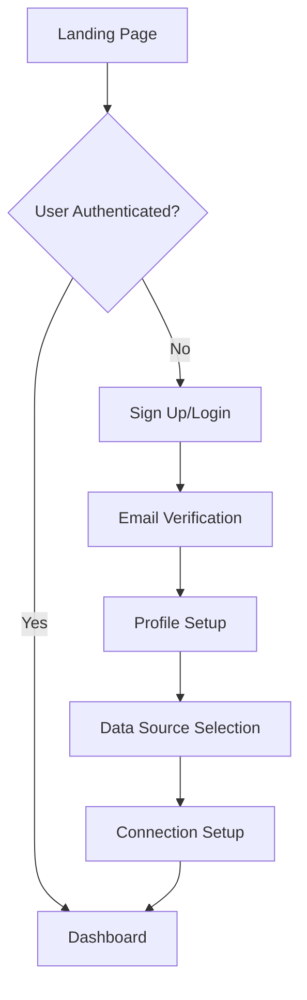
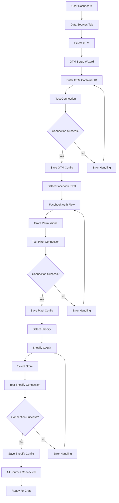
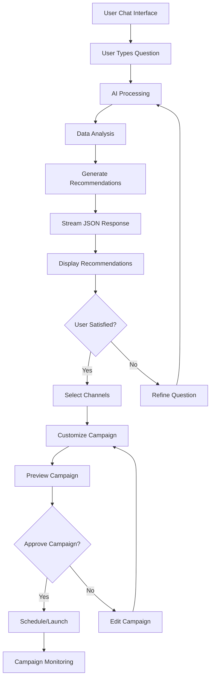
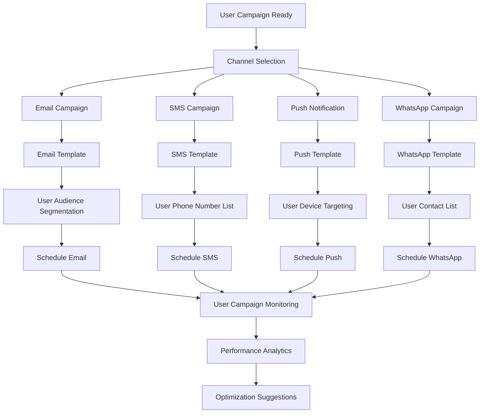

# User Flow Documentation

## Overview

This document outlines the complete user journey through the PulseHub platform, from initial onboarding to campaign execution and monitoring.

## User Journey Map

## Detailed User Flows

### 1. Onboarding Flow

### 2. Data Source Connection Flow

### 3. Chat Interface Flow

### 4. Campaign Execution Flow

## User Personas

### Primary Persona: Marketing Manager
- **Goals**: Increase conversion rates, optimize ad spend, improve customer engagement
- **Pain Points**: Data silos, manual campaign creation, lack of real-time insights
- **Use Cases**: 
  - "Show me customers who abandoned cart in the last 24 hours"
  - "Create a re-engagement campaign for inactive users"
  - "What's the best time to send emails to my segment?"

### Secondary Persona: E-commerce Owner
- **Goals**: Drive sales, reduce churn, increase customer lifetime value
- **Pain Points**: Limited marketing resources, complex analytics
- **Use Cases**:
  - "Target high-value customers with exclusive offers"
  - "Send personalized product recommendations"
  - "Create urgency campaigns for low-stock items"

## Key User Interactions

### 1. Natural Language Queries
- "Who are my most engaged customers this week?"
- "Create a campaign for users who viewed but didn't buy"
- "What's the optimal send time for my email list?"
- "Show me customers likely to churn in the next 30 days"

### 2. Data Exploration
- Real-time dashboard with connected data sources
- Interactive charts and visualizations
- Drill-down capabilities for detailed insights

### 3. Campaign Customization
- Drag-and-drop campaign builder
- A/B testing capabilities
- Real-time preview across all channels

### 4. Performance Monitoring
- Live campaign performance metrics
- Automated alerts and notifications
- ROI tracking and optimization suggestions

## Error Handling & Edge Cases

### Connection Failures
- Graceful degradation when data sources are unavailable
- Clear error messages with resolution steps
- Retry mechanisms for failed connections

### Data Quality Issues
- Validation of incoming data
- Fallback to cached data when real-time data is unavailable
- User notifications for data quality concerns

### Campaign Failures
- Rollback mechanisms for failed campaigns
- Detailed error logging and reporting
- Alternative channel suggestions when primary channels fail

## Success Metrics

### User Engagement
- Daily/Monthly Active Users
- Session duration and frequency
- Feature adoption rates

### Campaign Performance
- Campaign success rate
- Average conversion rate improvement
- Time to campaign creation

### Data Integration
- Data source uptime
- Data freshness and accuracy
- API response times

